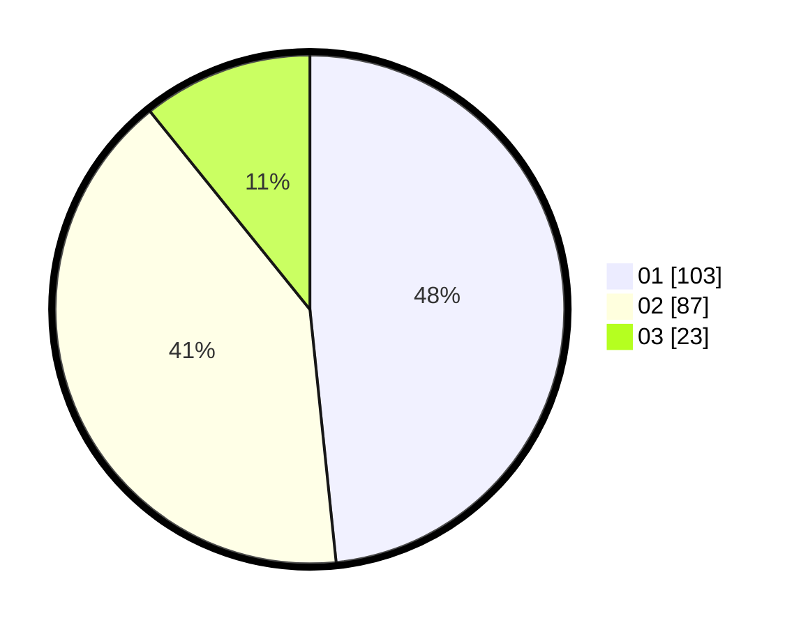

# Hasil

Hasil perolehan suara paslon dapat dilihat pada file paslon-01.txt, paslon-02.txt, dan paslon-03.txt.

Jika tidak ada, artinya data tersebut belum ada pada SIREKAP.

## Perolehan Suara

 * Paslon 01: **103**.
 * Paslon 02: **87**.
 * Paslon 03: **23**.

## Foto C Plano

https://sirekap-obj-formc.kpu.go.id/6b38/pemilu/ppwp/31/73/01/10/02/3173011002237-20240214-234154--585c9722-87a3-4078-8464-6e70098ac98d.jpg

https://sirekap-obj-formc.kpu.go.id/6b38/pemilu/ppwp/31/73/01/10/02/3173011002237-20240214-234237--9b0e349c-4a2a-4205-bfa1-69a135ec0cdf.jpg

https://sirekap-obj-formc.kpu.go.id/6b38/pemilu/ppwp/31/73/01/10/02/3173011002237-20240214-234309--a2b65ae5-569a-42a9-b8d6-63b1c3d38d7f.jpg
