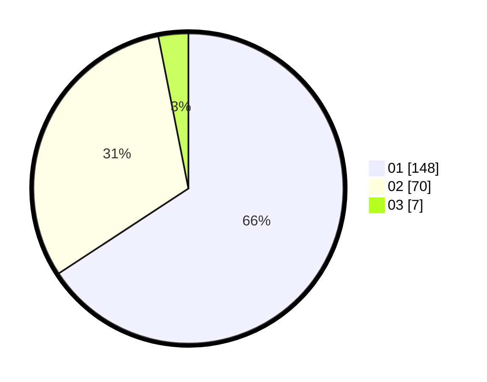

# Hasil

Hasil perolehan suara paslon dapat dilihat pada file paslon-01.txt, paslon-02.txt, dan paslon-03.txt.

Jika tidak ada, artinya data tersebut belum ada pada SIREKAP.

## Perolehan Suara

 * Paslon 01: **148**.
 * Paslon 02: **70**.
 * Paslon 03: **7**.

## Foto C Plano

https://sirekap-obj-formc.kpu.go.id/8ee2/pemilu/ppwp/31/73/01/10/02/3173011002240-20240214-200237--2580f93b-ad40-4e82-918a-a8f4b418cae2.jpg

https://sirekap-obj-formc.kpu.go.id/8ee2/pemilu/ppwp/31/73/01/10/02/3173011002240-20240215-222513--6cacc403-d609-4248-9eed-229d0c49c450.jpg

https://sirekap-obj-formc.kpu.go.id/8ee2/pemilu/ppwp/31/73/01/10/02/3173011002240-20240214-200307--17d00ef6-c9d9-4f9f-862c-c3cfeca5274c.jpg

## DATA PEMILIH TETAP

Jumlah pemilih dalam DPT: **269**.
 * L: **136**.
 * P: **133**.

## DATA PENGGUNA HAK PILIH

Jumlah pengguna hak pilih dalam DPT: **227**.
 * L: **108**.
 * P: **119**.

Jumlah pengguna hak pilih dalam DPTb: **0**.
 * L: **0**.
 * P: **0**.

Jumlah pengguna hak pilih dalam DPK: **1**.
 * L: **1**.
 * P: **0**.

Jumlah pengguna hak pilih: **228**.
 * L: **109**.
 * P: **119**.

## JUMLAH SUARA SAH DAN TIDAK SAH

JUMLAH SELURUH SUARA SAH: **225**.

JUMLAH SUARA TIDAK SAH: **3**.

JUMLAH SELURUH SUARA SAH DAN SUARA TIDAK SAH: **228**.
