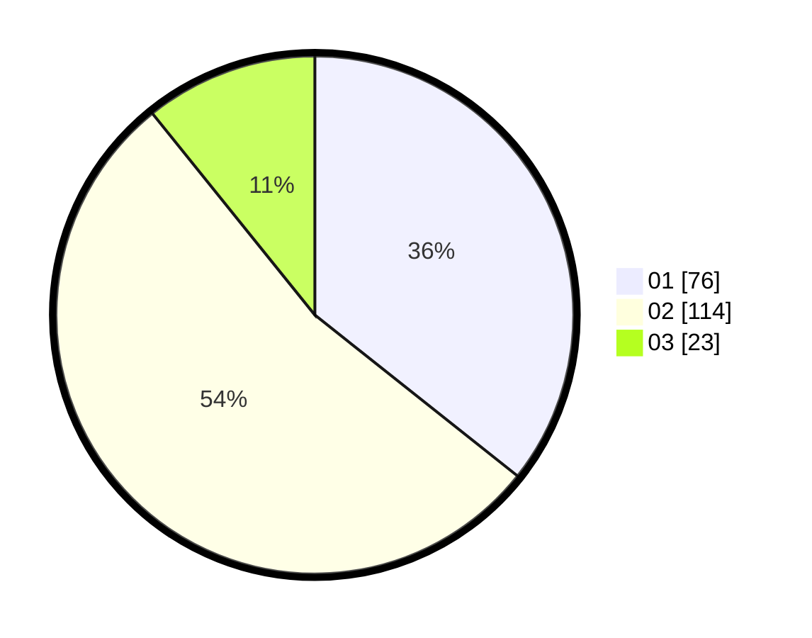

# Hasil

Hasil perolehan suara paslon dapat dilihat pada file paslon-01.txt, paslon-02.txt, dan paslon-03.txt.

Jika tidak ada, artinya data tersebut belum ada pada SIREKAP.

## Perolehan Suara

 * Paslon 01: **76**.
 * Paslon 02: **114**.
 * Paslon 03: **23**.

## Foto C Plano

https://sirekap-obj-formc.kpu.go.id/1ed3/pemilu/ppwp/31/73/01/10/02/3173011002245-20240216-062628--313c7198-4b18-4f4f-b664-d49069c7039d.jpg

https://sirekap-obj-formc.kpu.go.id/1ed3/pemilu/ppwp/31/73/01/10/02/3173011002245-20240216-062629--c56e0ba1-2d0b-4871-bc05-83567df0f09a.jpg

https://sirekap-obj-formc.kpu.go.id/1ed3/pemilu/ppwp/31/73/01/10/02/3173011002245-20240216-062628--abb5d71d-c5e5-497a-9e7d-87f6623761d1.jpg

## DATA PEMILIH TETAP

Jumlah pemilih dalam DPT: **269**.
 * L: **143**.
 * P: **126**.

## DATA PENGGUNA HAK PILIH

Jumlah pengguna hak pilih dalam DPT: **209**.
 * L: **106**.
 * P: **103**.

Jumlah pengguna hak pilih dalam DPTb: **7**.
 * L: **4**.
 * P: **3**.

Jumlah pengguna hak pilih dalam DPK: **0**.
 * L: **0**.
 * P: **0**.

Jumlah pengguna hak pilih: **216**.
 * L: **110**.
 * P: **106**.

## JUMLAH SUARA SAH DAN TIDAK SAH

JUMLAH SELURUH SUARA SAH: **213**.

JUMLAH SUARA TIDAK SAH: **3**.

JUMLAH SELURUH SUARA SAH DAN SUARA TIDAK SAH: **216**.
