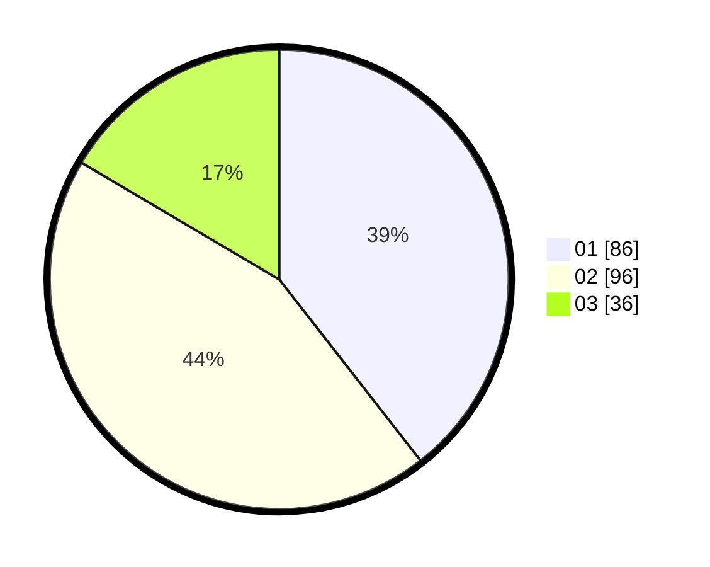

# Hasil

Hasil perolehan suara paslon dapat dilihat pada file paslon-01.txt, paslon-02.txt, dan paslon-03.txt.

Jika tidak ada, artinya data tersebut belum ada pada SIREKAP.

## Perolehan Suara

 * Paslon 01: **86**.
 * Paslon 02: **96**.
 * Paslon 03: **36**.

## Foto C Plano

https://sirekap-obj-formc.kpu.go.id/f2c9/pemilu/ppwp/31/73/01/10/02/3173011002247-20240216-132130--8ec9aefe-1210-44b0-af40-963700283768.jpg

https://sirekap-obj-formc.kpu.go.id/f2c9/pemilu/ppwp/31/73/01/10/02/3173011002247-20240216-132131--47a65d97-c2e7-443f-b82f-4041ea1ef84a.jpg

https://sirekap-obj-formc.kpu.go.id/f2c9/pemilu/ppwp/31/73/01/10/02/3173011002247-20240216-132130--26ef6eed-a82d-46dc-8a6b-2473cc78ed7a.jpg

## DATA PEMILIH TETAP

Jumlah pemilih dalam DPT: **270**.
 * L: **131**.
 * P: **139**.

## DATA PENGGUNA HAK PILIH

Jumlah pengguna hak pilih dalam DPT: **220**.
 * L: **108**.
 * P: **112**.

Jumlah pengguna hak pilih dalam DPTb: **0**.
 * L: **0**.
 * P: **0**.

Jumlah pengguna hak pilih dalam DPK: **0**.
 * L: **0**.
 * P: **0**.

Jumlah pengguna hak pilih: **220**.
 * L: **108**.
 * P: **112**.

## JUMLAH SUARA SAH DAN TIDAK SAH

JUMLAH SELURUH SUARA SAH: **218**.

JUMLAH SUARA TIDAK SAH: **2**.

JUMLAH SELURUH SUARA SAH DAN SUARA TIDAK SAH: **220**.
