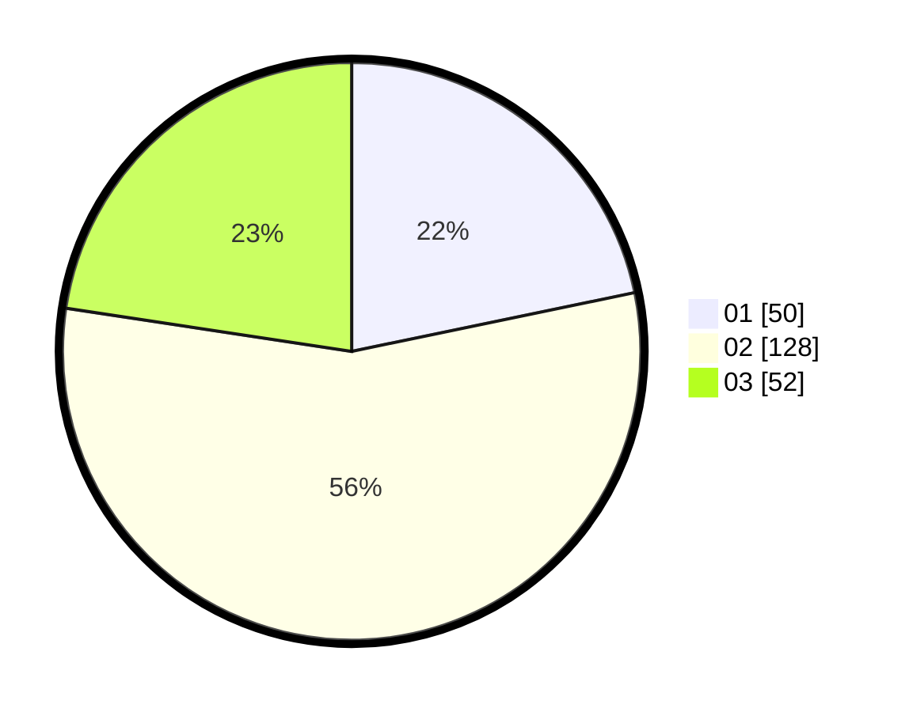

# Hasil

Hasil perolehan suara paslon dapat dilihat pada file paslon-01.txt, paslon-02.txt, dan paslon-03.txt.

Jika tidak ada, artinya data tersebut belum ada pada SIREKAP.

## Perolehan Suara

 * Paslon 01: **50**.
 * Paslon 02: **128**.
 * Paslon 03: **52**.

## Foto C Plano

https://sirekap-obj-formc.kpu.go.id/cc42/pemilu/ppwp/31/73/01/10/02/3173011002248-20240214-192929--9caf9a26-b2b4-44db-889f-298a84f46182.jpg

https://sirekap-obj-formc.kpu.go.id/cc42/pemilu/ppwp/31/73/01/10/02/3173011002248-20240214-193027--a438011f-5327-46aa-bc6b-0d01efeeec4d.jpg

https://sirekap-obj-formc.kpu.go.id/cc42/pemilu/ppwp/31/73/01/10/02/3173011002248-20240214-194646--62d2ee90-d8b0-473e-88d5-5aea8b9d4b48.jpg

## DATA PEMILIH TETAP

Jumlah pemilih dalam DPT: **265**.
 * L: **132**.
 * P: **133**.

## DATA PENGGUNA HAK PILIH

Jumlah pengguna hak pilih dalam DPT: **230**.
 * L: **114**.
 * P: **116**.

Jumlah pengguna hak pilih dalam DPTb: **1**.
 * L: **0**.
 * P: **1**.

Jumlah pengguna hak pilih dalam DPK: **2**.
 * L: **1**.
 * P: **1**.

Jumlah pengguna hak pilih: **233**.
 * L: **115**.
 * P: **118**.

## JUMLAH SUARA SAH DAN TIDAK SAH

JUMLAH SELURUH SUARA SAH: **230**.

JUMLAH SUARA TIDAK SAH: **3**.

JUMLAH SELURUH SUARA SAH DAN SUARA TIDAK SAH: **233**.
