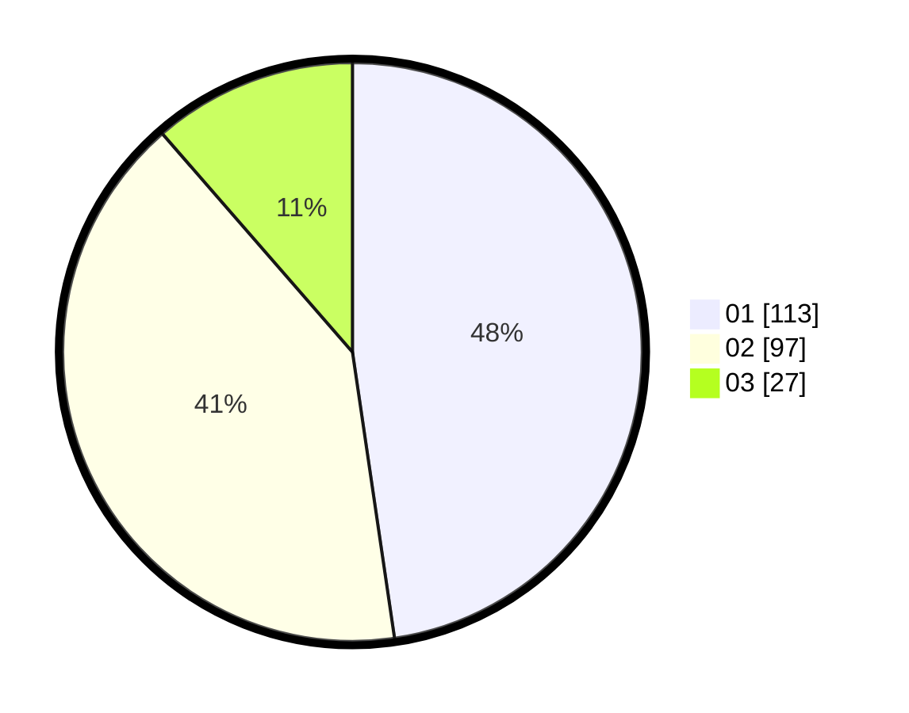

# Hasil

Hasil perolehan suara paslon dapat dilihat pada file paslon-01.txt, paslon-02.txt, dan paslon-03.txt.

Jika tidak ada, artinya data tersebut belum ada pada SIREKAP.

## Perolehan Suara

 * Paslon 01: **113**.
 * Paslon 02: **97**.
 * Paslon 03: **27**.

## Foto C Plano

https://sirekap-obj-formc.kpu.go.id/36d8/pemilu/ppwp/31/73/01/10/02/3173011002250-20240216-125543--a6a75f2b-7383-4539-855c-30f9102e3519.jpg

https://sirekap-obj-formc.kpu.go.id/36d8/pemilu/ppwp/31/73/01/10/02/3173011002250-20240216-125545--bcd0bc4d-897b-4c61-9ed8-d34def5c6503.jpg

https://sirekap-obj-formc.kpu.go.id/36d8/pemilu/ppwp/31/73/01/10/02/3173011002250-20240215-020134--f5834bdc-67f0-46e4-ba01-6a9013b07821.jpg

## DATA PEMILIH TETAP

Jumlah pemilih dalam DPT: **275**.
 * L: **138**.
 * P: **137**.

## DATA PENGGUNA HAK PILIH

Jumlah pengguna hak pilih dalam DPT: **234**.
 * L: **116**.
 * P: **118**.

Jumlah pengguna hak pilih dalam DPTb: **1**.
 * L: **0**.
 * P: **1**.

Jumlah pengguna hak pilih dalam DPK: **4**.
 * L: **2**.
 * P: **2**.

Jumlah pengguna hak pilih: **239**.
 * L: **118**.
 * P: **121**.

## JUMLAH SUARA SAH DAN TIDAK SAH

JUMLAH SELURUH SUARA SAH: **237**.

JUMLAH SUARA TIDAK SAH: **2**.

JUMLAH SELURUH SUARA SAH DAN SUARA TIDAK SAH: **239**.
