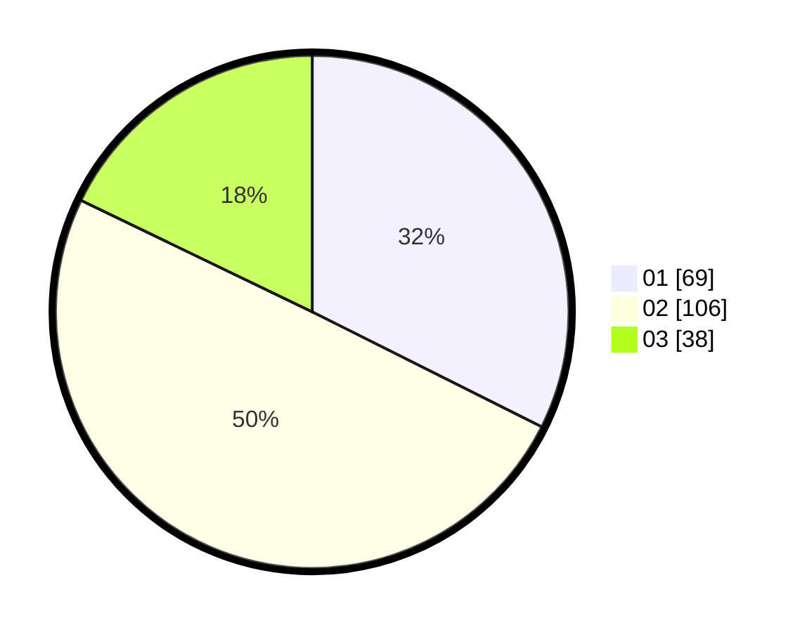

# Hasil

Hasil perolehan suara paslon dapat dilihat pada file paslon-01.txt, paslon-02.txt, dan paslon-03.txt.

Jika tidak ada, artinya data tersebut belum ada pada SIREKAP.

## Perolehan Suara

 * Paslon 01: **69**.
 * Paslon 02: **106**.
 * Paslon 03: **38**.

## Foto C Plano

https://sirekap-obj-formc.kpu.go.id/720b/pemilu/ppwp/31/73/01/10/02/3173011002251-20240216-120554--0959f316-1491-459e-82b9-9d740325efbe.jpg

https://sirekap-obj-formc.kpu.go.id/720b/pemilu/ppwp/31/73/01/10/02/3173011002251-20240215-040236--a119151c-c67d-4133-9b7c-a33b22da4476.jpg

https://sirekap-obj-formc.kpu.go.id/720b/pemilu/ppwp/31/73/01/10/02/3173011002251-20240216-120555--9f3208df-324e-4ffe-bfe5-985e68961409.jpg

## DATA PEMILIH TETAP

Jumlah pemilih dalam DPT: **272**.
 * L: **143**.
 * P: **129**.

## DATA PENGGUNA HAK PILIH

Jumlah pengguna hak pilih dalam DPT: **214**.
 * L: **107**.
 * P: **107**.

Jumlah pengguna hak pilih dalam DPTb: **0**.
 * L: **0**.
 * P: **0**.

Jumlah pengguna hak pilih dalam DPK: **0**.
 * L: **0**.
 * P: **0**.

Jumlah pengguna hak pilih: **214**.
 * L: **107**.
 * P: **107**.

## JUMLAH SUARA SAH DAN TIDAK SAH

JUMLAH SELURUH SUARA SAH: **213**.

JUMLAH SUARA TIDAK SAH: **1**.

JUMLAH SELURUH SUARA SAH DAN SUARA TIDAK SAH: **214**.
