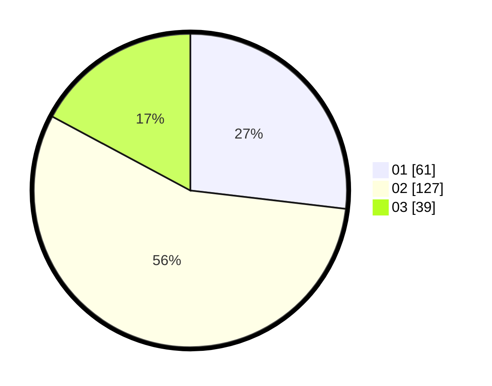

# Hasil

Hasil perolehan suara paslon dapat dilihat pada file paslon-01.txt, paslon-02.txt, dan paslon-03.txt.

Jika tidak ada, artinya data tersebut belum ada pada SIREKAP.

## Perolehan Suara

 * Paslon 01: **61**.
 * Paslon 02: **127**.
 * Paslon 03: **39**.

## Foto C Plano

https://sirekap-obj-formc.kpu.go.id/4020/pemilu/ppwp/31/73/01/10/02/3173011002254-20240215-113034--b281188d-ad6b-4174-aaee-0785400048cf.jpg

https://sirekap-obj-formc.kpu.go.id/4020/pemilu/ppwp/31/73/01/10/02/3173011002254-20240215-113127--cf5970cb-5e14-404d-b43b-1cf5999dc6b4.jpg

https://sirekap-obj-formc.kpu.go.id/4020/pemilu/ppwp/31/73/01/10/02/3173011002254-20240215-113205--16803543-c815-4d19-bd6f-5391429c6fcb.jpg
