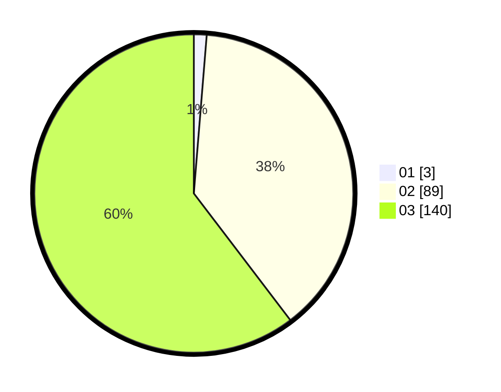

# Hasil

Hasil perolehan suara paslon dapat dilihat pada file paslon-01.txt, paslon-02.txt, dan paslon-03.txt.

Jika tidak ada, artinya data tersebut belum ada pada SIREKAP.

## Perolehan Suara

 * Paslon 01: **3**.
 * Paslon 02: **89**.
 * Paslon 03: **140**.

## Foto C Plano

https://sirekap-obj-formc.kpu.go.id/3d56/pemilu/ppwp/31/73/01/10/02/3173011002272-20240214-200017--909ac0b3-ef68-4860-90bc-20ab4c357ac5.jpg

https://sirekap-obj-formc.kpu.go.id/3d56/pemilu/ppwp/31/73/01/10/02/3173011002272-20240214-200311--88dc0160-1b1d-4288-86af-9eea1fccc548.jpg

https://sirekap-obj-formc.kpu.go.id/3d56/pemilu/ppwp/31/73/01/10/02/3173011002272-20240214-200409--c1b61c40-a198-40d0-9337-56ec7fb18c9e.jpg

## DATA PEMILIH TETAP

Jumlah pemilih dalam DPT: **277**.
 * L: **135**.
 * P: **142**.

## DATA PENGGUNA HAK PILIH

Jumlah pengguna hak pilih dalam DPT: **220**.
 * L: **100**.
 * P: **120**.

Jumlah pengguna hak pilih dalam DPTb: **8**.
 * L: **4**.
 * P: **4**.

Jumlah pengguna hak pilih dalam DPK: **4**.
 * L: **3**.
 * P: **1**.

Jumlah pengguna hak pilih: **232**.
 * L: **107**.
 * P: **125**.

## JUMLAH SUARA SAH DAN TIDAK SAH

JUMLAH SELURUH SUARA SAH: **232**.

JUMLAH SUARA TIDAK SAH: **0**.

JUMLAH SELURUH SUARA SAH DAN SUARA TIDAK SAH: **232**.
