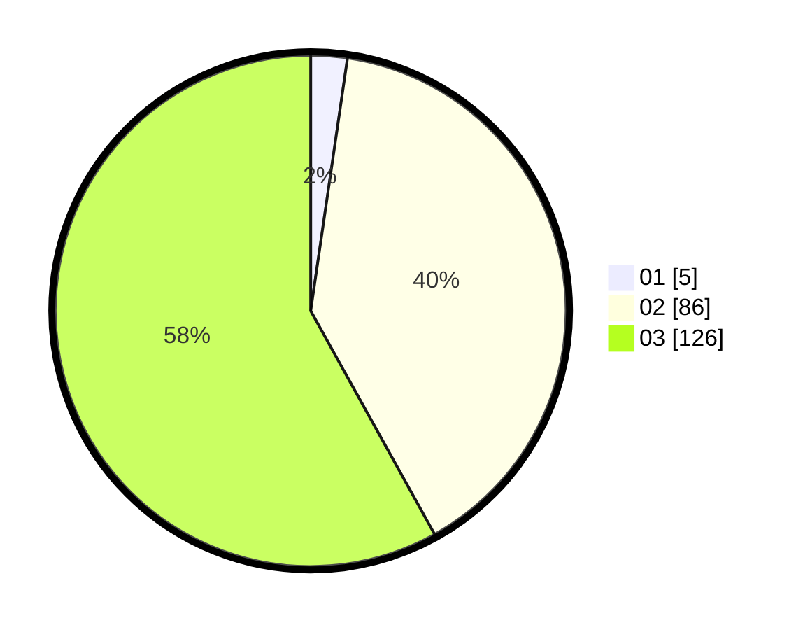

# Hasil

Hasil perolehan suara paslon dapat dilihat pada file paslon-01.txt, paslon-02.txt, dan paslon-03.txt.

Jika tidak ada, artinya data tersebut belum ada pada SIREKAP.

## Perolehan Suara

 * Paslon 01: **5**.
 * Paslon 02: **86**.
 * Paslon 03: **126**.

## Foto C Plano

https://sirekap-obj-formc.kpu.go.id/7153/pemilu/ppwp/31/73/01/10/02/3173011002273-20240216-090009--677a4b88-fc3c-47d0-bfdf-8cb682f2bc55.jpg

https://sirekap-obj-formc.kpu.go.id/7153/pemilu/ppwp/31/73/01/10/02/3173011002273-20240216-005148--19d329f9-1f96-48db-bd7b-fd323e8088f8.jpg

https://sirekap-obj-formc.kpu.go.id/7153/pemilu/ppwp/31/73/01/10/02/3173011002273-20240216-005146--d99fc87f-c15d-49ed-8e55-d0018641dafa.jpg

## DATA PEMILIH TETAP

Jumlah pemilih dalam DPT: **214**.
 * L: **101**.
 * P: **113**.

## DATA PENGGUNA HAK PILIH

Jumlah pengguna hak pilih dalam DPT: **214**.
 * L: **101**.
 * P: **113**.

Jumlah pengguna hak pilih dalam DPTb: **0**.
 * L: **0**.
 * P: **0**.

Jumlah pengguna hak pilih dalam DPK: **5**.
 * L: **3**.
 * P: **2**.

Jumlah pengguna hak pilih: **219**.
 * L: **104**.
 * P: **115**.

## JUMLAH SUARA SAH DAN TIDAK SAH

JUMLAH SELURUH SUARA SAH: **217**.

JUMLAH SUARA TIDAK SAH: **2**.

JUMLAH SELURUH SUARA SAH DAN SUARA TIDAK SAH: **219**.
