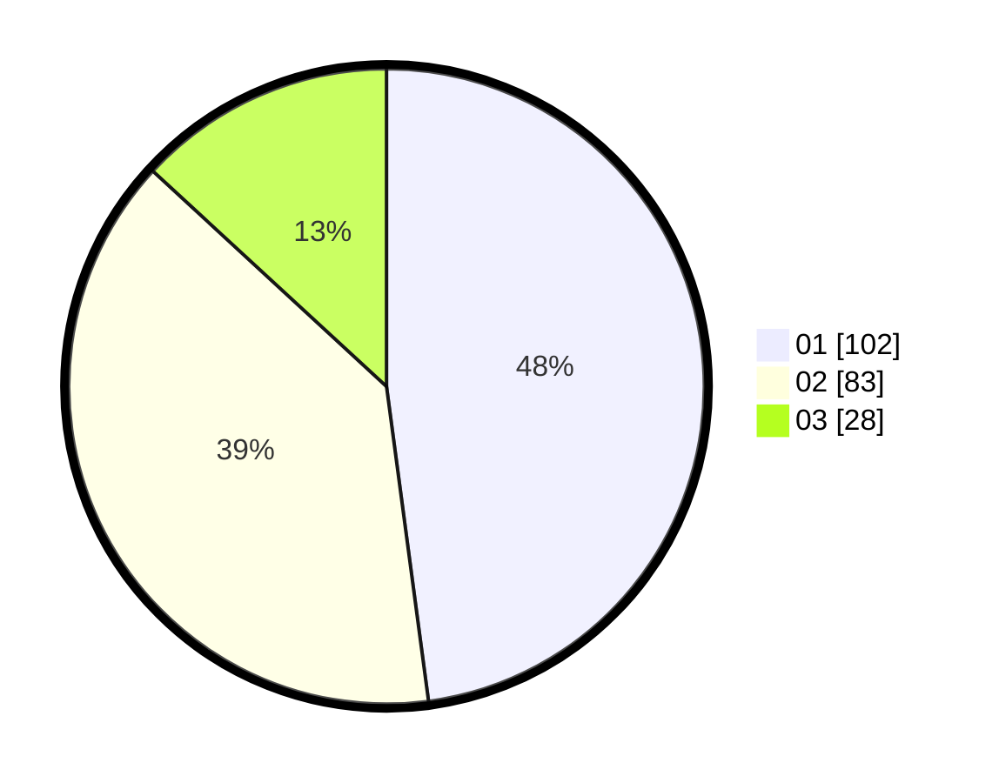

# Hasil

Hasil perolehan suara paslon dapat dilihat pada file paslon-01.txt, paslon-02.txt, dan paslon-03.txt.

Jika tidak ada, artinya data tersebut belum ada pada SIREKAP.

## Perolehan Suara

 * Paslon 01: **102**.
 * Paslon 02: **83**.
 * Paslon 03: **28**.

## Foto C Plano

https://sirekap-obj-formc.kpu.go.id/5d7c/pemilu/ppwp/31/73/01/10/02/3173011002274-20240214-220853--87040dbc-5024-4caf-a72f-01a6957e080f.jpg

https://sirekap-obj-formc.kpu.go.id/5d7c/pemilu/ppwp/31/73/01/10/02/3173011002274-20240214-220946--433f5b31-552b-4b67-a302-9abb9ce66f43.jpg

https://sirekap-obj-formc.kpu.go.id/5d7c/pemilu/ppwp/31/73/01/10/02/3173011002274-20240214-221044--85cb0d32-308d-4234-bd14-d53ee480f4b6.jpg
