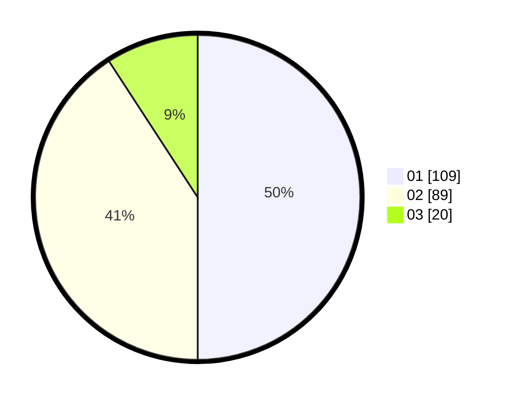

# Hasil

Hasil perolehan suara paslon dapat dilihat pada file paslon-01.txt, paslon-02.txt, dan paslon-03.txt.

Jika tidak ada, artinya data tersebut belum ada pada SIREKAP.

## Perolehan Suara

 * Paslon 01: **109**.
 * Paslon 02: **89**.
 * Paslon 03: **20**.

## Foto C Plano

https://sirekap-obj-formc.kpu.go.id/5083/pemilu/ppwp/31/73/01/10/02/3173011002275-20240215-231057--a7be8d34-7d58-4972-bccd-24836972c5da.jpg

https://sirekap-obj-formc.kpu.go.id/5083/pemilu/ppwp/31/73/01/10/02/3173011002275-20240215-231103--5cc34feb-b36c-4c35-b1ab-de96be552390.jpg

https://sirekap-obj-formc.kpu.go.id/5083/pemilu/ppwp/31/73/01/10/02/3173011002275-20240215-231059--e55d1c86-91f1-4132-adaa-6b080ec53b0e.jpg

## DATA PEMILIH TETAP

Jumlah pemilih dalam DPT: **0**.
 * L: **0**.
 * P: **0**.

## DATA PENGGUNA HAK PILIH

Jumlah pengguna hak pilih dalam DPT: **0**.
 * L: **0**.
 * P: **0**.

Jumlah pengguna hak pilih dalam DPTb: **0**.
 * L: **0**.
 * P: **0**.

Jumlah pengguna hak pilih dalam DPK: **0**.
 * L: **0**.
 * P: **0**.

Jumlah pengguna hak pilih: **0**.
 * L: **0**.
 * P: **0**.

## JUMLAH SUARA SAH DAN TIDAK SAH

JUMLAH SELURUH SUARA SAH: **218**.

JUMLAH SUARA TIDAK SAH: **4**.

JUMLAH SELURUH SUARA SAH DAN SUARA TIDAK SAH: **222**.
