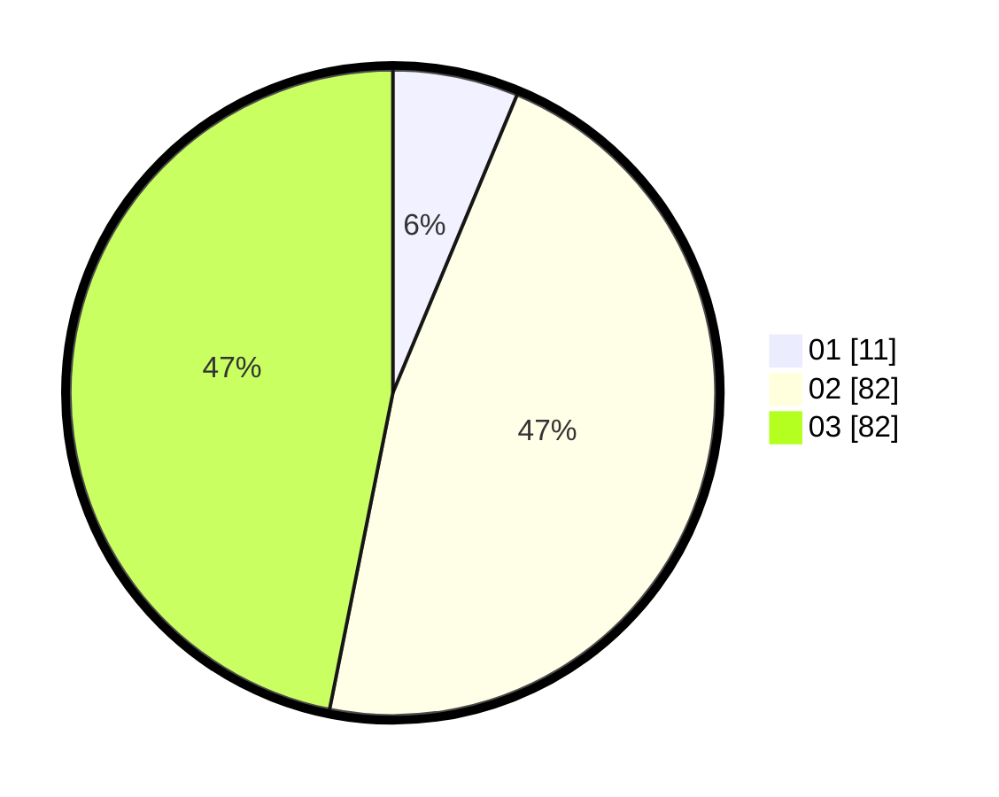

# Hasil

Hasil perolehan suara paslon dapat dilihat pada file paslon-01.txt, paslon-02.txt, dan paslon-03.txt.

Jika tidak ada, artinya data tersebut belum ada pada SIREKAP.

## Perolehan Suara

 * Paslon 01: **11**.
 * Paslon 02: **82**.
 * Paslon 03: **82**.

## Foto C Plano

https://sirekap-obj-formc.kpu.go.id/4fe5/pemilu/ppwp/31/73/01/10/02/3173011002276-20240216-031239--a52c1808-c705-4523-88d2-c90513c4bd07.jpg

https://sirekap-obj-formc.kpu.go.id/4fe5/pemilu/ppwp/31/73/01/10/02/3173011002276-20240216-031241--7323444a-e9ce-4da4-b709-411802aeaa61.jpg

https://sirekap-obj-formc.kpu.go.id/4fe5/pemilu/ppwp/31/73/01/10/02/3173011002276-20240216-031240--8d33707d-c72b-4daf-a63f-0d88e0d29179.jpg

## DATA PEMILIH TETAP

Jumlah pemilih dalam DPT: **224**.
 * L: **109**.
 * P: **115**.

## DATA PENGGUNA HAK PILIH

Jumlah pengguna hak pilih dalam DPT: **166**.
 * L: **79**.
 * P: **87**.

Jumlah pengguna hak pilih dalam DPTb: **2**.
 * L: **0**.
 * P: **2**.

Jumlah pengguna hak pilih dalam DPK: **7**.
 * L: **2**.
 * P: **5**.

Jumlah pengguna hak pilih: **175**.
 * L: **81**.
 * P: **94**.

## JUMLAH SUARA SAH DAN TIDAK SAH

JUMLAH SELURUH SUARA SAH: **175**.

JUMLAH SUARA TIDAK SAH: **4**.

JUMLAH SELURUH SUARA SAH DAN SUARA TIDAK SAH: **179**.
