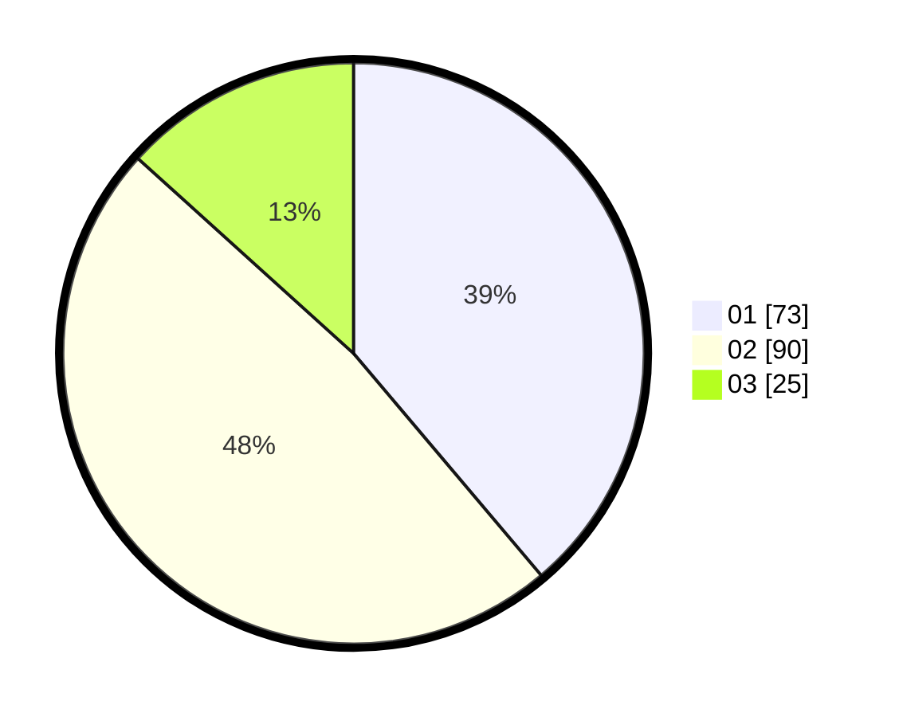

# Hasil

Hasil perolehan suara paslon dapat dilihat pada file paslon-01.txt, paslon-02.txt, dan paslon-03.txt.

Jika tidak ada, artinya data tersebut belum ada pada SIREKAP.

## Perolehan Suara

 * Paslon 01: **73**.
 * Paslon 02: **90**.
 * Paslon 03: **25**.

## Foto C Plano

https://sirekap-obj-formc.kpu.go.id/6939/pemilu/ppwp/31/73/01/10/03/3173011003001-20240215-025000--8c9c556d-2cf5-499e-a283-6637864c35ea.jpg

https://sirekap-obj-formc.kpu.go.id/6939/pemilu/ppwp/31/73/01/10/03/3173011003001-20240215-022216--48d6c50f-73d1-49d1-be39-02fae41359b4.jpg

https://sirekap-obj-formc.kpu.go.id/6939/pemilu/ppwp/31/73/01/10/03/3173011003001-20240215-024740--44caf0b1-de8f-4ff1-be80-05db8fea2bfb.jpg
