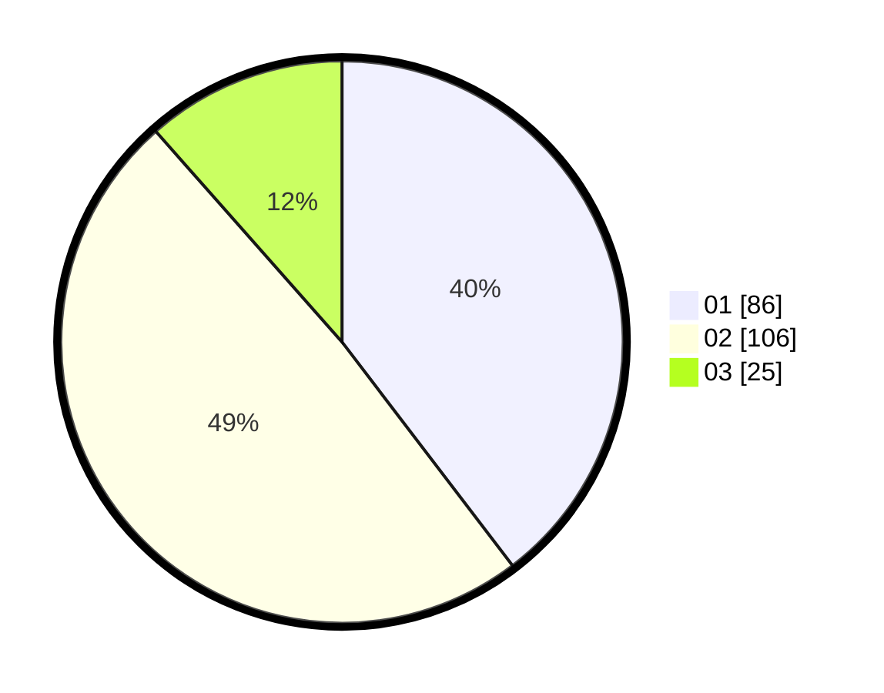

# Hasil

Hasil perolehan suara paslon dapat dilihat pada file paslon-01.txt, paslon-02.txt, dan paslon-03.txt.

Jika tidak ada, artinya data tersebut belum ada pada SIREKAP.

## Perolehan Suara

 * Paslon 01: **86**.
 * Paslon 02: **106**.
 * Paslon 03: **25**.

## Foto C Plano

https://sirekap-obj-formc.kpu.go.id/7cd3/pemilu/ppwp/31/73/01/10/03/3173011003002-20240214-215738--b5b39446-4cc3-4340-a39b-abb68e98403e.jpg

https://sirekap-obj-formc.kpu.go.id/7cd3/pemilu/ppwp/31/73/01/10/03/3173011003002-20240214-203822--8e29870c-83c5-4a0e-8217-d907d0399847.jpg

https://sirekap-obj-formc.kpu.go.id/7cd3/pemilu/ppwp/31/73/01/10/03/3173011003002-20240214-204014--01cbe9ec-ffff-4d3b-9654-4ddeb79ae626.jpg

## DATA PEMILIH TETAP

Jumlah pemilih dalam DPT: **277**.
 * L: **141**.
 * P: **136**.

## DATA PENGGUNA HAK PILIH

Jumlah pengguna hak pilih dalam DPT: **198**.
 * L: **100**.
 * P: **98**.

Jumlah pengguna hak pilih dalam DPTb: **20**.
 * L: **19**.
 * P: **1**.

Jumlah pengguna hak pilih dalam DPK: **0**.
 * L: **0**.
 * P: **0**.

Jumlah pengguna hak pilih: **218**.
 * L: **119**.
 * P: **99**.

## JUMLAH SUARA SAH DAN TIDAK SAH

JUMLAH SELURUH SUARA SAH: **217**.

JUMLAH SUARA TIDAK SAH: **1**.

JUMLAH SELURUH SUARA SAH DAN SUARA TIDAK SAH: **218**.
