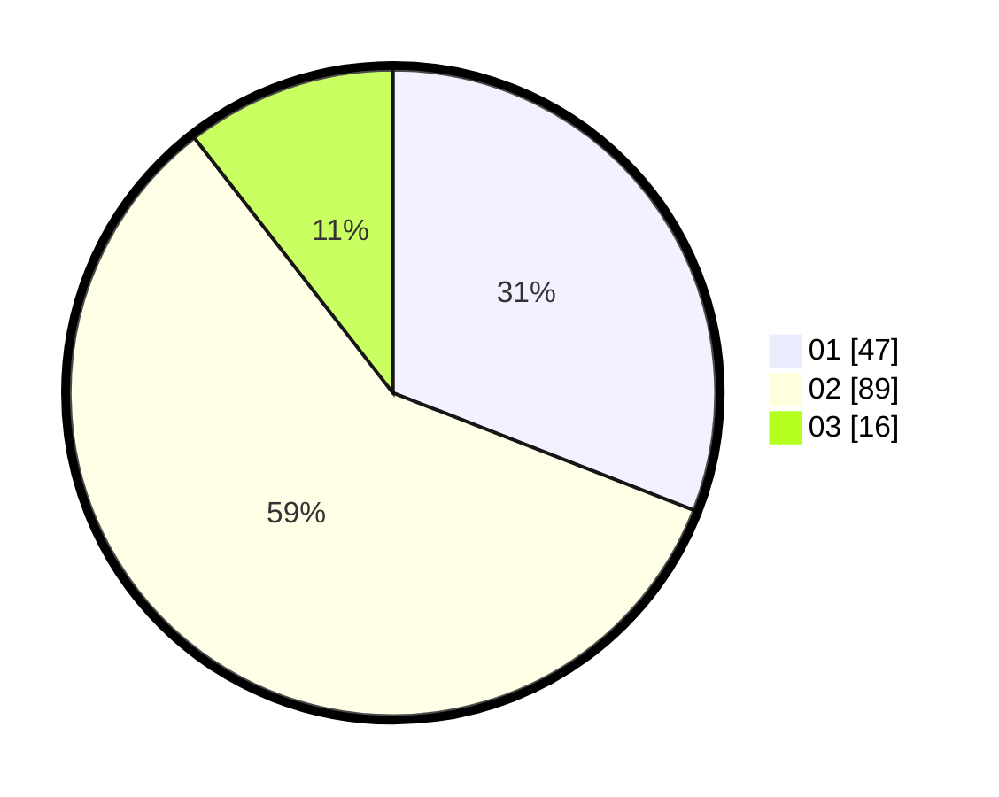

# Hasil

Hasil perolehan suara paslon dapat dilihat pada file paslon-01.txt, paslon-02.txt, dan paslon-03.txt.

Jika tidak ada, artinya data tersebut belum ada pada SIREKAP.

## Perolehan Suara

 * Paslon 01: **47**.
 * Paslon 02: **89**.
 * Paslon 03: **16**.

## Foto C Plano

https://sirekap-obj-formc.kpu.go.id/3cfa/pemilu/ppwp/31/73/01/10/03/3173011003004-20240216-024005--d9e0adc5-b802-4968-979c-731d12a482be.jpg

https://sirekap-obj-formc.kpu.go.id/3cfa/pemilu/ppwp/31/73/01/10/03/3173011003004-20240216-022957--fbf97521-deaf-41e4-a479-6dfe7caf6a4b.jpg

https://sirekap-obj-formc.kpu.go.id/3cfa/pemilu/ppwp/31/73/01/10/03/3173011003004-20240216-022956--9124b67d-4a7c-4d87-8d0b-76257a8101da.jpg

## DATA PEMILIH TETAP

Jumlah pemilih dalam DPT: **221**.
 * L: **111**.
 * P: **110**.

## DATA PENGGUNA HAK PILIH

Jumlah pengguna hak pilih dalam DPT: **140**.
 * L: **70**.
 * P: **70**.

Jumlah pengguna hak pilih dalam DPTb: **11**.
 * L: **7**.
 * P: **4**.

Jumlah pengguna hak pilih dalam DPK: **3**.
 * L: **0**.
 * P: **3**.

Jumlah pengguna hak pilih: **154**.
 * L: **77**.
 * P: **77**.

## JUMLAH SUARA SAH DAN TIDAK SAH

JUMLAH SELURUH SUARA SAH: **152**.

JUMLAH SUARA TIDAK SAH: **2**.

JUMLAH SELURUH SUARA SAH DAN SUARA TIDAK SAH: **154**.
