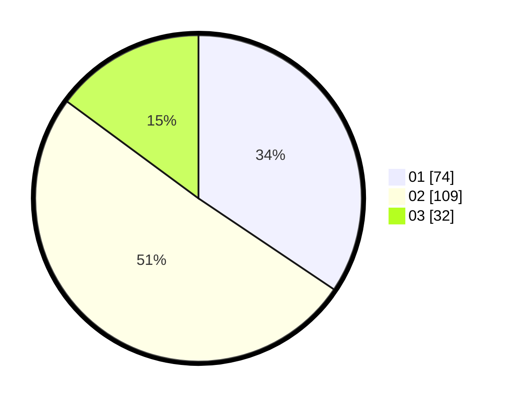

# Hasil

Hasil perolehan suara paslon dapat dilihat pada file paslon-01.txt, paslon-02.txt, dan paslon-03.txt.

Jika tidak ada, artinya data tersebut belum ada pada SIREKAP.

## Perolehan Suara

 * Paslon 01: **74**.
 * Paslon 02: **109**.
 * Paslon 03: **32**.

## Foto C Plano

https://sirekap-obj-formc.kpu.go.id/c623/pemilu/ppwp/31/73/01/10/03/3173011003006-20240216-051055--1286d5dd-5633-475f-afee-827ecd6ab185.jpg

https://sirekap-obj-formc.kpu.go.id/c623/pemilu/ppwp/31/73/01/10/03/3173011003006-20240216-051057--1dc00437-919b-4356-ae8f-5d4196598089.jpg

https://sirekap-obj-formc.kpu.go.id/c623/pemilu/ppwp/31/73/01/10/03/3173011003006-20240216-051056--63be24ef-367c-433b-a778-c4c69f21b1ef.jpg

## DATA PEMILIH TETAP

Jumlah pemilih dalam DPT: **300**.
 * L: **152**.
 * P: **148**.

## DATA PENGGUNA HAK PILIH

Jumlah pengguna hak pilih dalam DPT: **208**.
 * L: **97**.
 * P: **111**.

Jumlah pengguna hak pilih dalam DPTb: **11**.
 * L: **11**.
 * P: **0**.

Jumlah pengguna hak pilih dalam DPK: **1**.
 * L: **0**.
 * P: **1**.

Jumlah pengguna hak pilih: **220**.
 * L: **108**.
 * P: **112**.

## JUMLAH SUARA SAH DAN TIDAK SAH

JUMLAH SELURUH SUARA SAH: **215**.

JUMLAH SUARA TIDAK SAH: **5**.

JUMLAH SELURUH SUARA SAH DAN SUARA TIDAK SAH: **220**.
