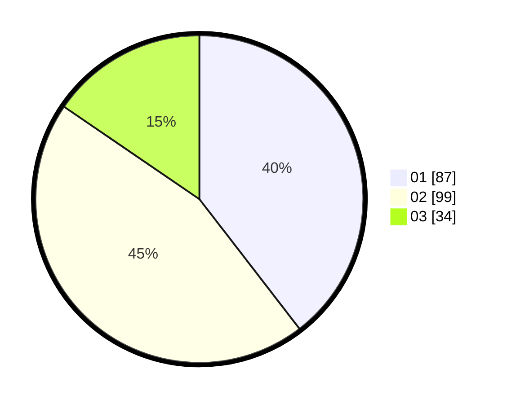

# Hasil

Hasil perolehan suara paslon dapat dilihat pada file paslon-01.txt, paslon-02.txt, dan paslon-03.txt.

Jika tidak ada, artinya data tersebut belum ada pada SIREKAP.

## Perolehan Suara

 * Paslon 01: **87**.
 * Paslon 02: **99**.
 * Paslon 03: **34**.

## Foto C Plano

https://sirekap-obj-formc.kpu.go.id/7d61/pemilu/ppwp/31/73/01/10/03/3173011003007-20240216-134018--a619c06b-3438-4285-bfdb-e331ef5b2f28.jpg

https://sirekap-obj-formc.kpu.go.id/7d61/pemilu/ppwp/31/73/01/10/03/3173011003007-20240216-141041--e4b6c56e-a0ef-447a-8001-76914386d184.jpg

https://sirekap-obj-formc.kpu.go.id/7d61/pemilu/ppwp/31/73/01/10/03/3173011003007-20240216-141041--8dc8710b-85ff-46cf-a7d2-c93994ced4b3.jpg

## DATA PEMILIH TETAP

Jumlah pemilih dalam DPT: **297**.
 * L: **148**.
 * P: **149**.

## DATA PENGGUNA HAK PILIH

Jumlah pengguna hak pilih dalam DPT: **225**.
 * L: **111**.
 * P: **114**.

Jumlah pengguna hak pilih dalam DPTb: **0**.
 * L: **0**.
 * P: **0**.

Jumlah pengguna hak pilih dalam DPK: **0**.
 * L: **0**.
 * P: **0**.

Jumlah pengguna hak pilih: **225**.
 * L: **111**.
 * P: **114**.

## JUMLAH SUARA SAH DAN TIDAK SAH

JUMLAH SELURUH SUARA SAH: **220**.

JUMLAH SUARA TIDAK SAH: **5**.

JUMLAH SELURUH SUARA SAH DAN SUARA TIDAK SAH: **225**.
