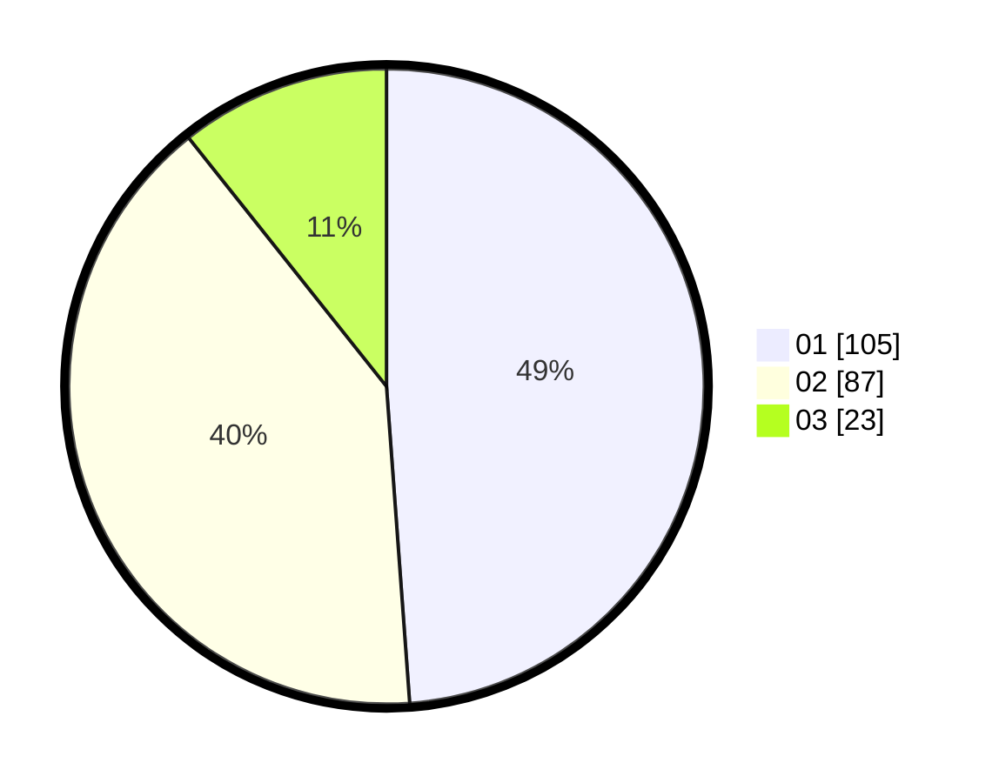

# Hasil

Hasil perolehan suara paslon dapat dilihat pada file paslon-01.txt, paslon-02.txt, dan paslon-03.txt.

Jika tidak ada, artinya data tersebut belum ada pada SIREKAP.

## Perolehan Suara

 * Paslon 01: **105**.
 * Paslon 02: **87**.
 * Paslon 03: **23**.

## Foto C Plano

https://sirekap-obj-formc.kpu.go.id/46e4/pemilu/ppwp/31/73/01/10/03/3173011003011-20240216-125548--3be8a2fb-8180-4cd7-93da-770f12675ed0.jpg

https://sirekap-obj-formc.kpu.go.id/46e4/pemilu/ppwp/31/73/01/10/03/3173011003011-20240216-125552--38eff293-a7f3-4d09-9ca2-5a6676262035.jpg

https://sirekap-obj-formc.kpu.go.id/46e4/pemilu/ppwp/31/73/01/10/03/3173011003011-20240216-125549--4f1be761-850a-40f4-9e08-2003d370f4d5.jpg

## DATA PEMILIH TETAP

Jumlah pemilih dalam DPT: **276**.
 * L: **155**.
 * P: **121**.

## DATA PENGGUNA HAK PILIH

Jumlah pengguna hak pilih dalam DPT: **276**.
 * L: **155**.
 * P: **121**.

Jumlah pengguna hak pilih dalam DPTb: **0**.
 * L: **0**.
 * P: **0**.

Jumlah pengguna hak pilih dalam DPK: **4**.
 * L: **2**.
 * P: **2**.

Jumlah pengguna hak pilih: **280**.
 * L: **157**.
 * P: **123**.

## JUMLAH SUARA SAH DAN TIDAK SAH

JUMLAH SELURUH SUARA SAH: **215**.

JUMLAH SUARA TIDAK SAH: **2**.

JUMLAH SELURUH SUARA SAH DAN SUARA TIDAK SAH: **217**.
