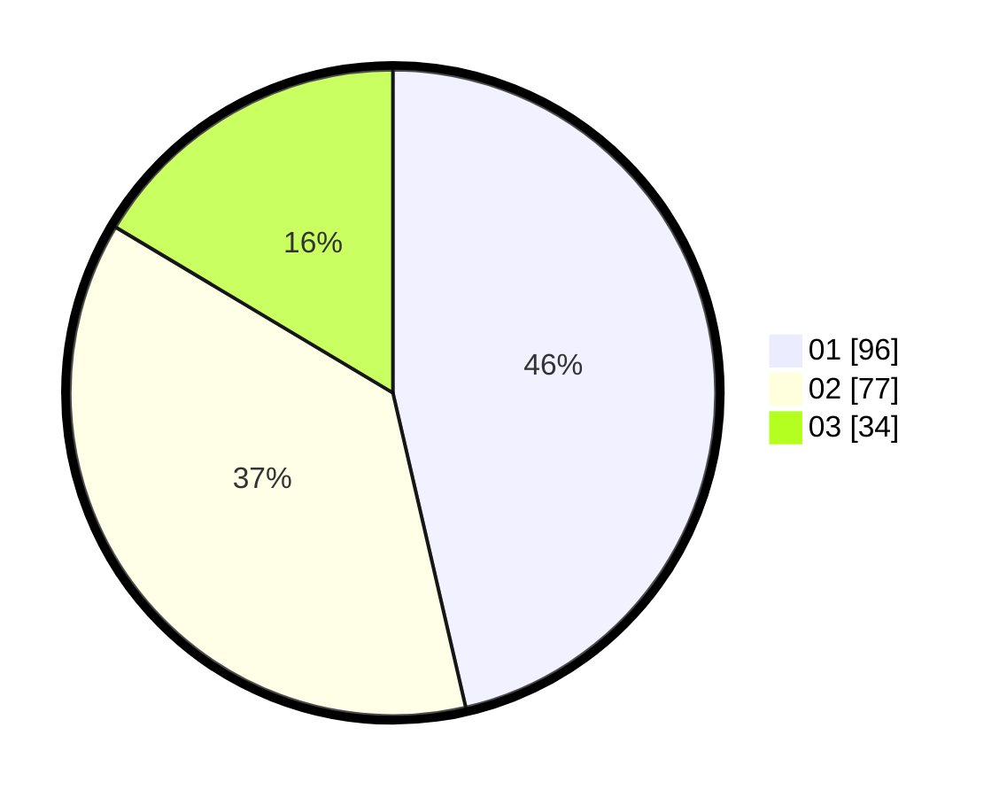

# Hasil

Hasil perolehan suara paslon dapat dilihat pada file paslon-01.txt, paslon-02.txt, dan paslon-03.txt.

Jika tidak ada, artinya data tersebut belum ada pada SIREKAP.

## Perolehan Suara

 * Paslon 01: **96**.
 * Paslon 02: **77**.
 * Paslon 03: **34**.

## Foto C Plano

https://sirekap-obj-formc.kpu.go.id/cd02/pemilu/ppwp/31/73/01/10/03/3173011003014-20240216-150509--aa534f22-8eb0-440d-a552-4e3e8e748811.jpg

https://sirekap-obj-formc.kpu.go.id/cd02/pemilu/ppwp/31/73/01/10/03/3173011003014-20240216-150510--1ea370a2-f771-4ae1-be84-8876e235bf8a.jpg

https://sirekap-obj-formc.kpu.go.id/cd02/pemilu/ppwp/31/73/01/10/03/3173011003014-20240216-150510--93adf9cf-c8bc-4e73-b06d-c32eccefcef5.jpg

## DATA PEMILIH TETAP

Jumlah pemilih dalam DPT: **279**.
 * L: **146**.
 * P: **133**.

## DATA PENGGUNA HAK PILIH

Jumlah pengguna hak pilih dalam DPT: **201**.
 * L: **97**.
 * P: **104**.

Jumlah pengguna hak pilih dalam DPTb: **0**.
 * L: **0**.
 * P: **0**.

Jumlah pengguna hak pilih dalam DPK: **7**.
 * L: **3**.
 * P: **4**.

Jumlah pengguna hak pilih: **208**.
 * L: **100**.
 * P: **108**.

## JUMLAH SUARA SAH DAN TIDAK SAH

JUMLAH SELURUH SUARA SAH: **207**.

JUMLAH SUARA TIDAK SAH: **1**.

JUMLAH SELURUH SUARA SAH DAN SUARA TIDAK SAH: **208**.
