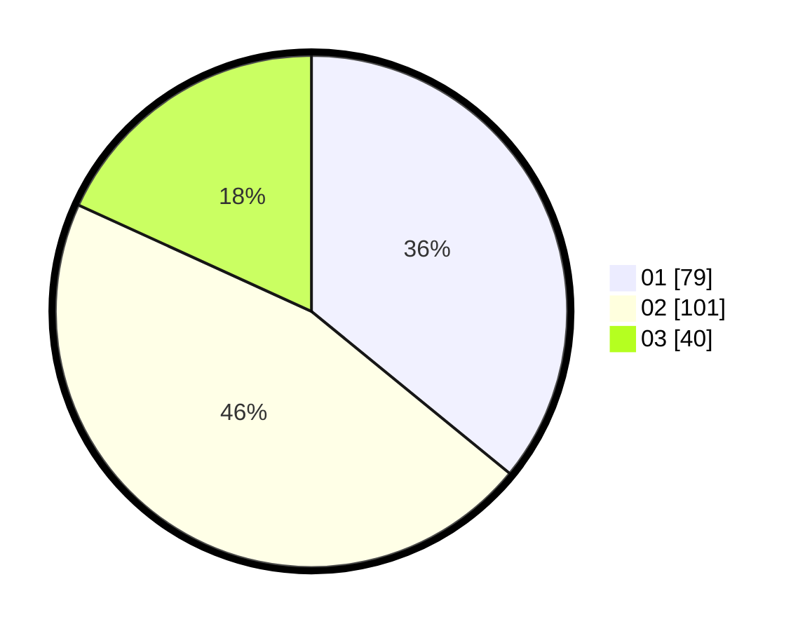

# Hasil

Hasil perolehan suara paslon dapat dilihat pada file paslon-01.txt, paslon-02.txt, dan paslon-03.txt.

Jika tidak ada, artinya data tersebut belum ada pada SIREKAP.

## Perolehan Suara

 * Paslon 01: **79**.
 * Paslon 02: **101**.
 * Paslon 03: **40**.

## Foto C Plano

https://sirekap-obj-formc.kpu.go.id/06e8/pemilu/ppwp/31/73/01/10/03/3173011003015-20240214-175444--7efacf91-fd64-4d7b-8f52-a15e8d53c9a9.jpg

https://sirekap-obj-formc.kpu.go.id/06e8/pemilu/ppwp/31/73/01/10/03/3173011003015-20240214-175447--d4a1d328-54d9-42de-92a5-b0e9430fa384.jpg

https://sirekap-obj-formc.kpu.go.id/06e8/pemilu/ppwp/31/73/01/10/03/3173011003015-20240214-190500--3276d807-21a8-4412-a6dd-efd1ce08c58b.jpg

## DATA PEMILIH TETAP

Jumlah pemilih dalam DPT: **283**.
 * L: **139**.
 * P: **144**.

## DATA PENGGUNA HAK PILIH

Jumlah pengguna hak pilih dalam DPT: **218**.
 * L: **99**.
 * P: **119**.

Jumlah pengguna hak pilih dalam DPTb: **0**.
 * L: **0**.
 * P: **0**.

Jumlah pengguna hak pilih dalam DPK: **3**.
 * L: **0**.
 * P: **3**.

Jumlah pengguna hak pilih: **221**.
 * L: **99**.
 * P: **122**.

## JUMLAH SUARA SAH DAN TIDAK SAH

JUMLAH SELURUH SUARA SAH: **220**.

JUMLAH SUARA TIDAK SAH: **1**.

JUMLAH SELURUH SUARA SAH DAN SUARA TIDAK SAH: **221**.
