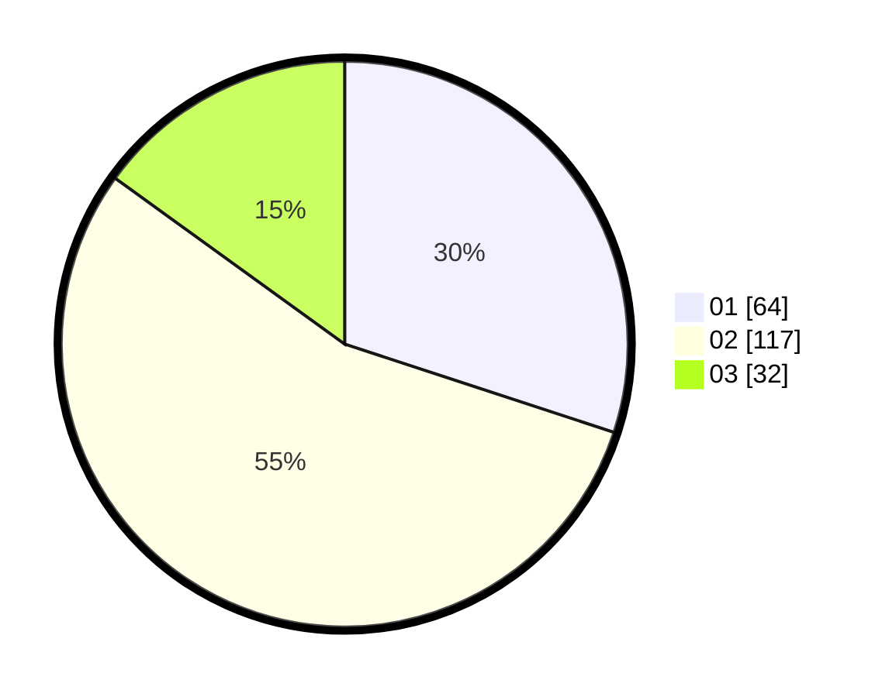

# Hasil

Hasil perolehan suara paslon dapat dilihat pada file paslon-01.txt, paslon-02.txt, dan paslon-03.txt.

Jika tidak ada, artinya data tersebut belum ada pada SIREKAP.

## Perolehan Suara

 * Paslon 01: **64**.
 * Paslon 02: **117**.
 * Paslon 03: **32**.

## Foto C Plano

https://sirekap-obj-formc.kpu.go.id/cde3/pemilu/ppwp/31/73/01/10/03/3173011003021-20240218-163405--f7d09dda-5e2b-46de-ab31-0fc2a85b446e.jpg

https://sirekap-obj-formc.kpu.go.id/cde3/pemilu/ppwp/31/73/01/10/03/3173011003021-20240218-163407--e3fcc3b6-0c03-443c-b796-fa7ffd2a2f77.jpg

https://sirekap-obj-formc.kpu.go.id/cde3/pemilu/ppwp/31/73/01/10/03/3173011003021-20240218-163406--6063223d-db79-4983-be93-c8153e42b7b8.jpg

## DATA PEMILIH TETAP

Jumlah pemilih dalam DPT: **290**.
 * L: **149**.
 * P: **141**.

## DATA PENGGUNA HAK PILIH

Jumlah pengguna hak pilih dalam DPT: **215**.
 * L: **110**.
 * P: **105**.

Jumlah pengguna hak pilih dalam DPTb: **0**.
 * L: **0**.
 * P: **0**.

Jumlah pengguna hak pilih dalam DPK: **2**.
 * L: **2**.
 * P: **0**.

Jumlah pengguna hak pilih: **217**.
 * L: **112**.
 * P: **105**.

## JUMLAH SUARA SAH DAN TIDAK SAH

JUMLAH SELURUH SUARA SAH: **213**.

JUMLAH SUARA TIDAK SAH: **4**.

JUMLAH SELURUH SUARA SAH DAN SUARA TIDAK SAH: **217**.
