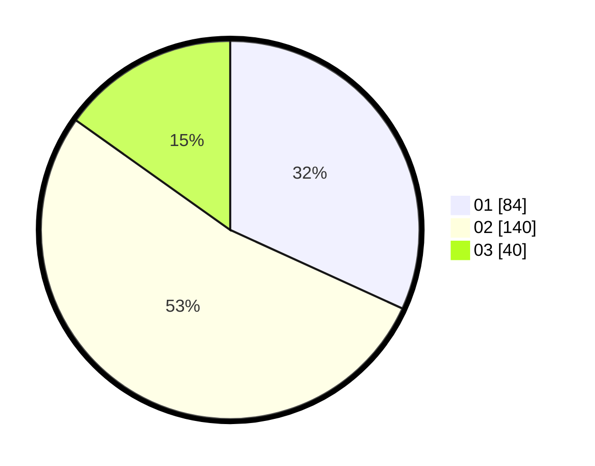

# Hasil

Hasil perolehan suara paslon dapat dilihat pada file paslon-01.txt, paslon-02.txt, dan paslon-03.txt.

Jika tidak ada, artinya data tersebut belum ada pada SIREKAP.

## Perolehan Suara

 * Paslon 01: **84**.
 * Paslon 02: **140**.
 * Paslon 03: **40**.

## Foto C Plano

https://sirekap-obj-formc.kpu.go.id/5bb4/pemilu/ppwp/31/73/01/10/03/3173011003025-20240216-103310--e1005f15-f6e6-4021-8bd9-862b7fc22315.jpg

https://sirekap-obj-formc.kpu.go.id/5bb4/pemilu/ppwp/31/73/01/10/03/3173011003025-20240216-103311--0dcccb92-694b-4146-918f-66ea3203f7f9.jpg

https://sirekap-obj-formc.kpu.go.id/5bb4/pemilu/ppwp/31/73/01/10/03/3173011003025-20240216-103310--7e874097-7b4f-4426-acae-ef2fe9e6e2a9.jpg

## DATA PEMILIH TETAP

Jumlah pemilih dalam DPT: **298**.
 * L: **145**.
 * P: **153**.

## DATA PENGGUNA HAK PILIH

Jumlah pengguna hak pilih dalam DPT: **256**.
 * L: **124**.
 * P: **132**.

Jumlah pengguna hak pilih dalam DPTb: **12**.
 * L: **6**.
 * P: **6**.

Jumlah pengguna hak pilih dalam DPK: **0**.
 * L: **0**.
 * P: **0**.

Jumlah pengguna hak pilih: **268**.
 * L: **130**.
 * P: **138**.

## JUMLAH SUARA SAH DAN TIDAK SAH

JUMLAH SELURUH SUARA SAH: **264**.

JUMLAH SUARA TIDAK SAH: **3**.

JUMLAH SELURUH SUARA SAH DAN SUARA TIDAK SAH: **267**.
