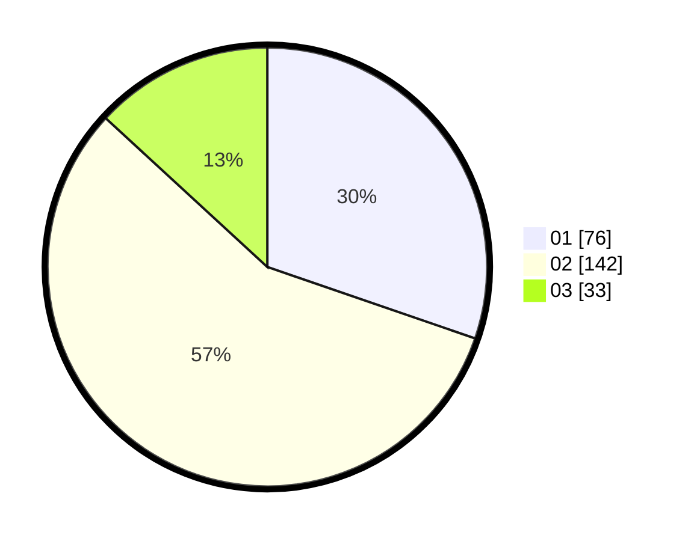

# Hasil

Hasil perolehan suara paslon dapat dilihat pada file paslon-01.txt, paslon-02.txt, dan paslon-03.txt.

Jika tidak ada, artinya data tersebut belum ada pada SIREKAP.

## Perolehan Suara

 * Paslon 01: **76**.
 * Paslon 02: **142**.
 * Paslon 03: **33**.

## Foto C Plano

https://sirekap-obj-formc.kpu.go.id/8cf4/pemilu/ppwp/31/73/01/10/03/3173011003026-20240215-042714--a24593c1-4252-4133-93f9-5062b892eebd.jpg

https://sirekap-obj-formc.kpu.go.id/8cf4/pemilu/ppwp/31/73/01/10/03/3173011003026-20240215-042812--e574d4ed-4bea-4efe-8892-c4d23caff1e5.jpg

https://sirekap-obj-formc.kpu.go.id/8cf4/pemilu/ppwp/31/73/01/10/03/3173011003026-20240215-042934--29d63c86-7874-49c7-b9b8-35a6011921e5.jpg
