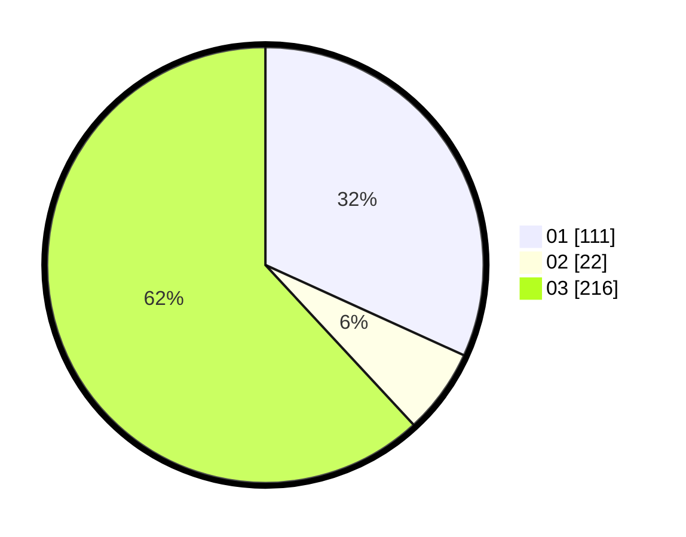

# Hasil

Hasil perolehan suara paslon dapat dilihat pada file paslon-01.txt, paslon-02.txt, dan paslon-03.txt.

Jika tidak ada, artinya data tersebut belum ada pada SIREKAP.

## Perolehan Suara

 * Paslon 01: **111**.
 * Paslon 02: **22**.
 * Paslon 03: **216**.

## Foto C Plano

https://sirekap-obj-formc.kpu.go.id/c4aa/pemilu/ppwp/31/73/01/10/03/3173011003033-20240216-004830--66a83a41-fbf5-40c5-b7a6-792e278a1ea9.jpg

https://sirekap-obj-formc.kpu.go.id/c4aa/pemilu/ppwp/31/73/01/10/03/3173011003033-20240216-004840--2fd4adeb-8db4-47a3-8e25-e51141a02f88.jpg

https://sirekap-obj-formc.kpu.go.id/c4aa/pemilu/ppwp/31/73/01/10/03/3173011003033-20240216-004836--31a8f0d5-8880-4599-9ab4-b00eff34d625.jpg

## DATA PEMILIH TETAP

Jumlah pemilih dalam DPT: **287**.
 * L: **139**.
 * P: **148**.

## DATA PENGGUNA HAK PILIH

Jumlah pengguna hak pilih dalam DPT: **210**.
 * L: **98**.
 * P: **112**.

Jumlah pengguna hak pilih dalam DPTb: **3**.
 * L: **2**.
 * P: **1**.

Jumlah pengguna hak pilih dalam DPK: **3**.
 * L: **1**.
 * P: **2**.

Jumlah pengguna hak pilih: **216**.
 * L: **101**.
 * P: **115**.

## JUMLAH SUARA SAH DAN TIDAK SAH

JUMLAH SELURUH SUARA SAH: **214**.

JUMLAH SUARA TIDAK SAH: **2**.

JUMLAH SELURUH SUARA SAH DAN SUARA TIDAK SAH: **216**.
