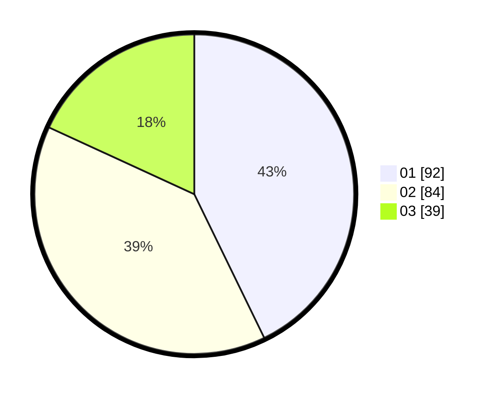

# Hasil

Hasil perolehan suara paslon dapat dilihat pada file paslon-01.txt, paslon-02.txt, dan paslon-03.txt.

Jika tidak ada, artinya data tersebut belum ada pada SIREKAP.

## Perolehan Suara

 * Paslon 01: **92**.
 * Paslon 02: **84**.
 * Paslon 03: **39**.

## Foto C Plano

https://sirekap-obj-formc.kpu.go.id/c39c/pemilu/ppwp/31/73/01/10/03/3173011003034-20240215-210513--46c45956-6693-4e82-918d-46308b7613b2.jpg

https://sirekap-obj-formc.kpu.go.id/c39c/pemilu/ppwp/31/73/01/10/03/3173011003034-20240215-210515--fb088979-3da5-440e-815d-e15d64311507.jpg

https://sirekap-obj-formc.kpu.go.id/c39c/pemilu/ppwp/31/73/01/10/03/3173011003034-20240215-210514--ed75b978-f702-427a-afff-caff36e5b1af.jpg

## DATA PEMILIH TETAP

Jumlah pemilih dalam DPT: **277**.
 * L: **141**.
 * P: **136**.

## DATA PENGGUNA HAK PILIH

Jumlah pengguna hak pilih dalam DPT: **212**.
 * L: **104**.
 * P: **108**.

Jumlah pengguna hak pilih dalam DPTb: **2**.
 * L: **1**.
 * P: **1**.

Jumlah pengguna hak pilih dalam DPK: **4**.
 * L: **2**.
 * P: **2**.

Jumlah pengguna hak pilih: **218**.
 * L: **107**.
 * P: **111**.

## JUMLAH SUARA SAH DAN TIDAK SAH

JUMLAH SELURUH SUARA SAH: **215**.

JUMLAH SUARA TIDAK SAH: **3**.

JUMLAH SELURUH SUARA SAH DAN SUARA TIDAK SAH: **218**.
