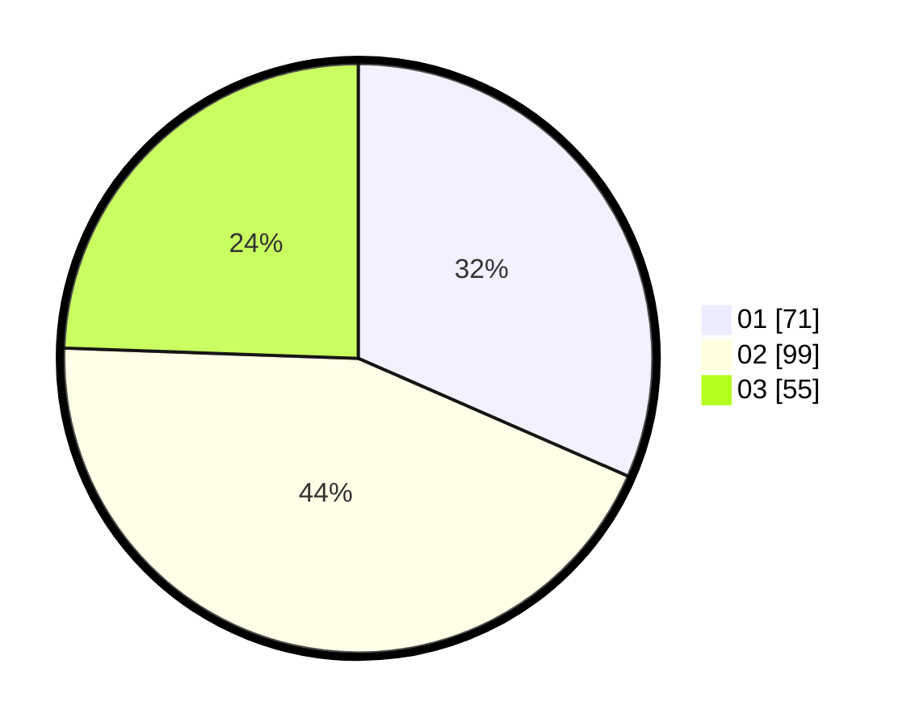

# Hasil

Hasil perolehan suara paslon dapat dilihat pada file paslon-01.txt, paslon-02.txt, dan paslon-03.txt.

Jika tidak ada, artinya data tersebut belum ada pada SIREKAP.

## Perolehan Suara

 * Paslon 01: **71**.
 * Paslon 02: **99**.
 * Paslon 03: **55**.

## Foto C Plano

https://sirekap-obj-formc.kpu.go.id/188a/pemilu/ppwp/31/73/01/10/03/3173011003039-20240215-214634--d55279e4-636c-441a-82b0-ba4281b09183.jpg

https://sirekap-obj-formc.kpu.go.id/188a/pemilu/ppwp/31/73/01/10/03/3173011003039-20240215-214635--987d0517-7bec-4d04-ae0f-8470830bade9.jpg

https://sirekap-obj-formc.kpu.go.id/188a/pemilu/ppwp/31/73/01/10/03/3173011003039-20240215-214635--de6b3b45-ea90-44ef-abd8-cc22020941a2.jpg

## DATA PEMILIH TETAP

Jumlah pemilih dalam DPT: **231**.
 * L: **103**.
 * P: **128**.

## DATA PENGGUNA HAK PILIH

Jumlah pengguna hak pilih dalam DPT: **231**.
 * L: **103**.
 * P: **128**.

Jumlah pengguna hak pilih dalam DPTb: **1**.
 * L: **1**.
 * P: **0**.

Jumlah pengguna hak pilih dalam DPK: **0**.
 * L: **0**.
 * P: **0**.

Jumlah pengguna hak pilih: **232**.
 * L: **104**.
 * P: **128**.

## JUMLAH SUARA SAH DAN TIDAK SAH

JUMLAH SELURUH SUARA SAH: **225**.

JUMLAH SUARA TIDAK SAH: **7**.

JUMLAH SELURUH SUARA SAH DAN SUARA TIDAK SAH: **232**.
