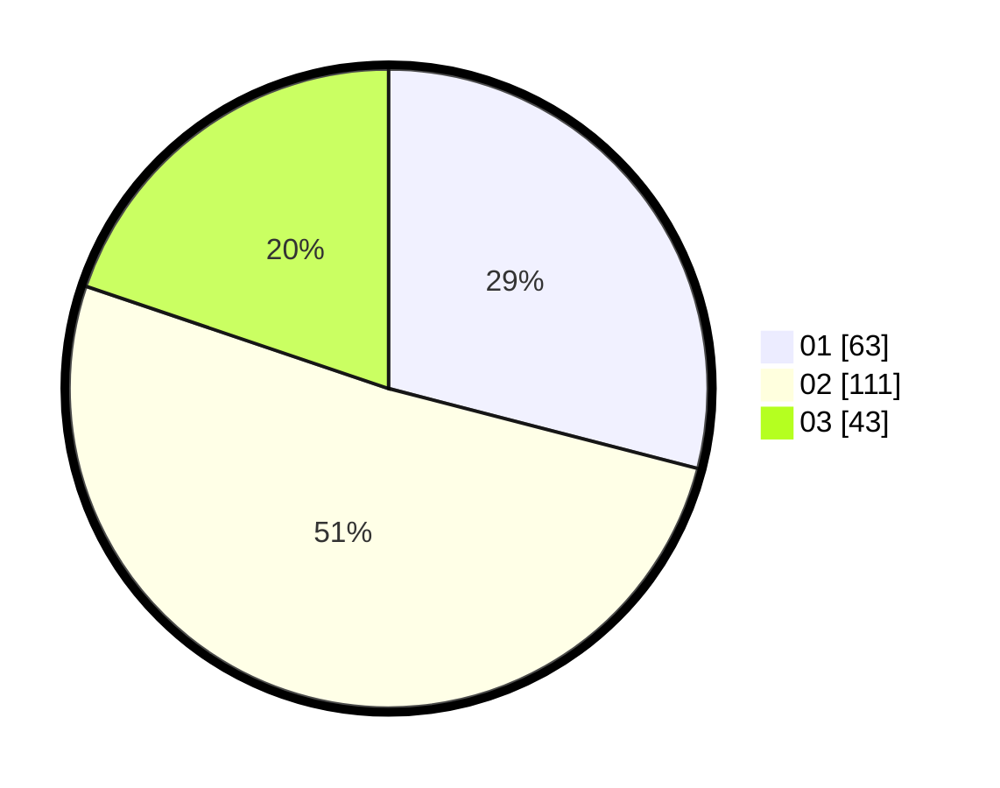

# Hasil

Hasil perolehan suara paslon dapat dilihat pada file paslon-01.txt, paslon-02.txt, dan paslon-03.txt.

Jika tidak ada, artinya data tersebut belum ada pada SIREKAP.

## Perolehan Suara

 * Paslon 01: **63**.
 * Paslon 02: **111**.
 * Paslon 03: **43**.

## Foto C Plano

https://sirekap-obj-formc.kpu.go.id/94fe/pemilu/ppwp/31/73/01/10/03/3173011003040-20240216-152050--7fa48625-4827-4aab-995a-b6382e6a5a83.jpg

https://sirekap-obj-formc.kpu.go.id/94fe/pemilu/ppwp/31/73/01/10/03/3173011003040-20240216-152052--4c67698a-75b0-44ac-b1d7-443eb460d5c5.jpg

https://sirekap-obj-formc.kpu.go.id/94fe/pemilu/ppwp/31/73/01/10/03/3173011003040-20240216-152051--17ee5eee-1ee2-4319-ac88-2fb0c02ddbc9.jpg

## DATA PEMILIH TETAP

Jumlah pemilih dalam DPT: **286**.
 * L: **143**.
 * P: **143**.

## DATA PENGGUNA HAK PILIH

Jumlah pengguna hak pilih dalam DPT: **222**.
 * L: **109**.
 * P: **113**.

Jumlah pengguna hak pilih dalam DPTb: **0**.
 * L: **0**.
 * P: **0**.

Jumlah pengguna hak pilih dalam DPK: **0**.
 * L: **0**.
 * P: **0**.

Jumlah pengguna hak pilih: **222**.
 * L: **109**.
 * P: **113**.

## JUMLAH SUARA SAH DAN TIDAK SAH

JUMLAH SELURUH SUARA SAH: **217**.

JUMLAH SUARA TIDAK SAH: **5**.

JUMLAH SELURUH SUARA SAH DAN SUARA TIDAK SAH: **222**.
