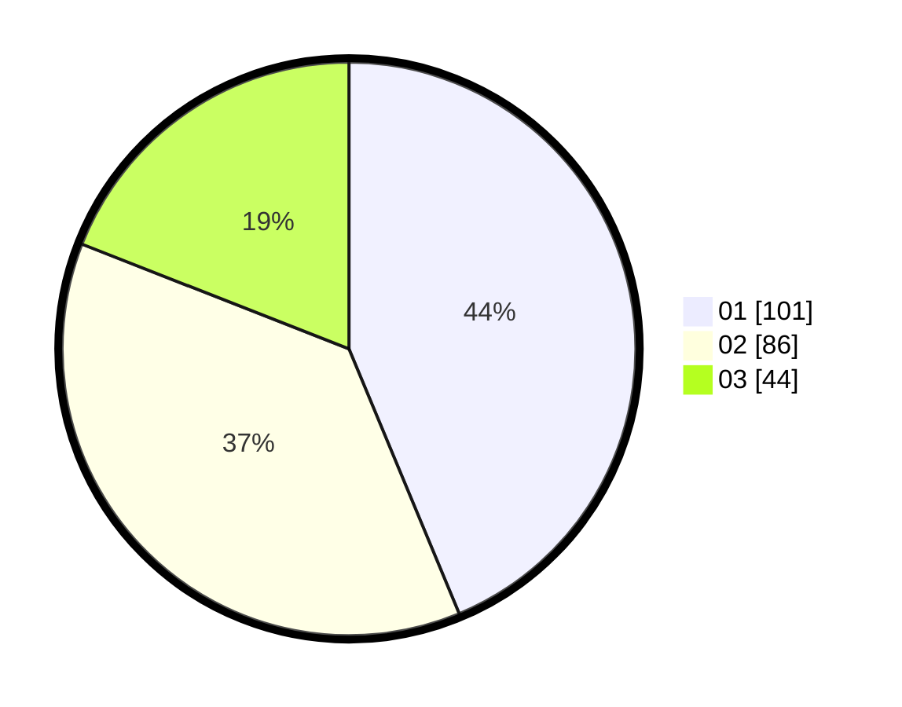

# Hasil

Hasil perolehan suara paslon dapat dilihat pada file paslon-01.txt, paslon-02.txt, dan paslon-03.txt.

Jika tidak ada, artinya data tersebut belum ada pada SIREKAP.

## Perolehan Suara

 * Paslon 01: **101**.
 * Paslon 02: **86**.
 * Paslon 03: **44**.

## Foto C Plano

https://sirekap-obj-formc.kpu.go.id/12b6/pemilu/ppwp/31/73/01/10/03/3173011003041-20240216-152922--d0dc1182-840f-4726-b61a-3841b62e671b.jpg

https://sirekap-obj-formc.kpu.go.id/12b6/pemilu/ppwp/31/73/01/10/03/3173011003041-20240216-152923--a88fa704-377a-408f-8f00-3080787473a9.jpg

https://sirekap-obj-formc.kpu.go.id/12b6/pemilu/ppwp/31/73/01/10/03/3173011003041-20240216-152923--95e1d8d1-5402-4ad9-8e6a-0cc39551f4a2.jpg

## DATA PEMILIH TETAP

Jumlah pemilih dalam DPT: **0**.
 * L: **0**.
 * P: **0**.

## DATA PENGGUNA HAK PILIH

Jumlah pengguna hak pilih dalam DPT: **0**.
 * L: **0**.
 * P: **0**.

Jumlah pengguna hak pilih dalam DPTb: **0**.
 * L: **0**.
 * P: **0**.

Jumlah pengguna hak pilih dalam DPK: **0**.
 * L: **0**.
 * P: **0**.

Jumlah pengguna hak pilih: **0**.
 * L: **0**.
 * P: **0**.

## JUMLAH SUARA SAH DAN TIDAK SAH

JUMLAH SELURUH SUARA SAH: **231**.

JUMLAH SUARA TIDAK SAH: **7**.

JUMLAH SELURUH SUARA SAH DAN SUARA TIDAK SAH: **238**.
