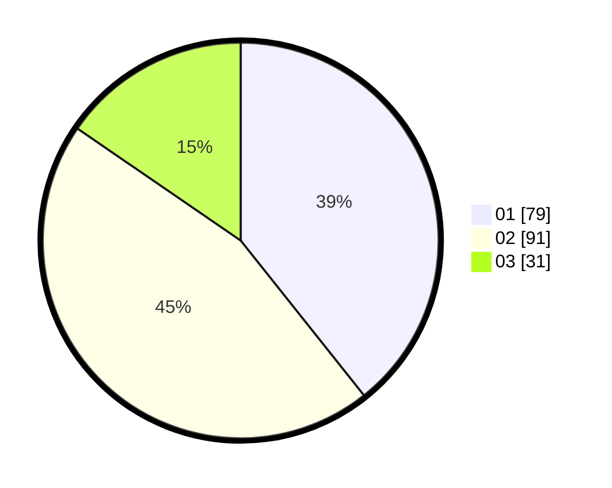

# Hasil

Hasil perolehan suara paslon dapat dilihat pada file paslon-01.txt, paslon-02.txt, dan paslon-03.txt.

Jika tidak ada, artinya data tersebut belum ada pada SIREKAP.

## Perolehan Suara

 * Paslon 01: **79**.
 * Paslon 02: **91**.
 * Paslon 03: **31**.

## Foto C Plano

https://sirekap-obj-formc.kpu.go.id/f7c8/pemilu/ppwp/31/73/01/10/03/3173011003042-20240218-132023--86353925-520f-469d-b921-52fe5fcabd0f.jpg

https://sirekap-obj-formc.kpu.go.id/f7c8/pemilu/ppwp/31/73/01/10/03/3173011003042-20240218-132025--9fa8ab14-53c3-4fe4-9f69-44c021dc738b.jpg

https://sirekap-obj-formc.kpu.go.id/f7c8/pemilu/ppwp/31/73/01/10/03/3173011003042-20240218-132024--96c1ebee-56c7-4dd0-97bf-c0b2bee63ddb.jpg

## DATA PEMILIH TETAP

Jumlah pemilih dalam DPT: **280**.
 * L: **140**.
 * P: **140**.

## DATA PENGGUNA HAK PILIH

Jumlah pengguna hak pilih dalam DPT: **203**.
 * L: **101**.
 * P: **102**.

Jumlah pengguna hak pilih dalam DPTb: **1**.
 * L: **0**.
 * P: **1**.

Jumlah pengguna hak pilih dalam DPK: **2**.
 * L: **0**.
 * P: **2**.

Jumlah pengguna hak pilih: **206**.
 * L: **101**.
 * P: **105**.

## JUMLAH SUARA SAH DAN TIDAK SAH

JUMLAH SELURUH SUARA SAH: **201**.

JUMLAH SUARA TIDAK SAH: **5**.

JUMLAH SELURUH SUARA SAH DAN SUARA TIDAK SAH: **206**.
