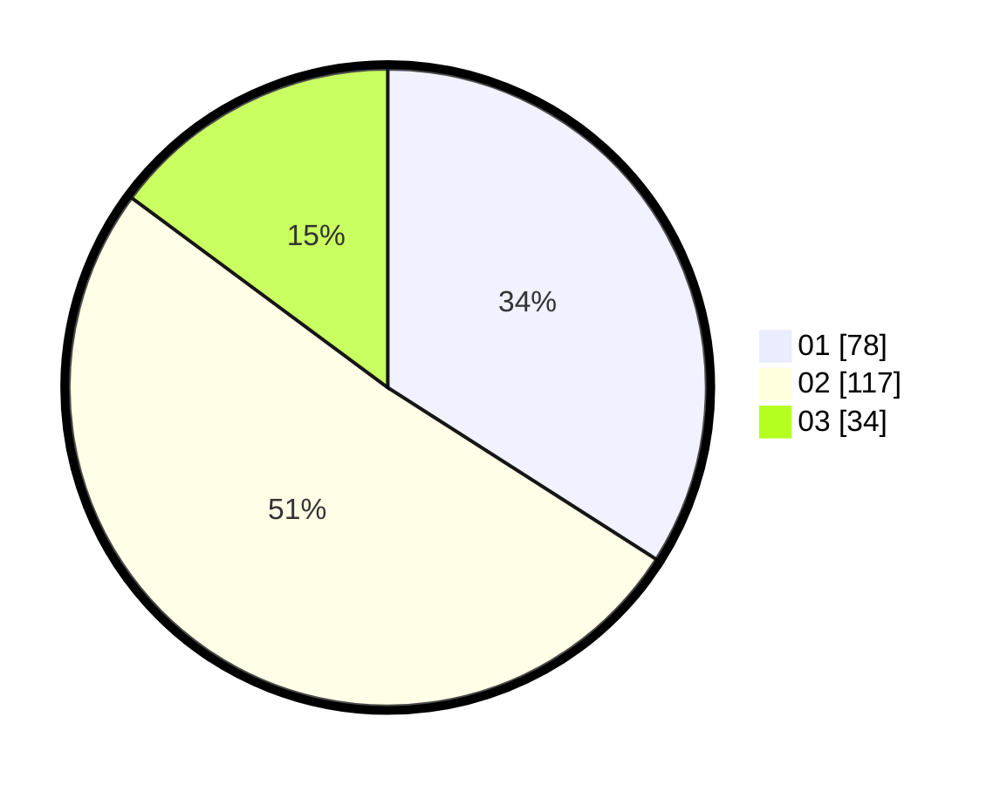

# Hasil

Hasil perolehan suara paslon dapat dilihat pada file paslon-01.txt, paslon-02.txt, dan paslon-03.txt.

Jika tidak ada, artinya data tersebut belum ada pada SIREKAP.

## Perolehan Suara

 * Paslon 01: **78**.
 * Paslon 02: **117**.
 * Paslon 03: **34**.

## Foto C Plano

https://sirekap-obj-formc.kpu.go.id/a621/pemilu/ppwp/31/73/01/10/03/3173011003044-20240214-202627--9a5080e0-b9fb-45a7-bc95-70d251ee0b14.jpg

https://sirekap-obj-formc.kpu.go.id/a621/pemilu/ppwp/31/73/01/10/03/3173011003044-20240214-202727--13342f0a-da79-4f17-8d96-8f1f0ea86992.jpg

https://sirekap-obj-formc.kpu.go.id/a621/pemilu/ppwp/31/73/01/10/03/3173011003044-20240214-202858--8ddc7b79-5cac-48fa-967c-5b2b74bf66c0.jpg

## DATA PEMILIH TETAP

Jumlah pemilih dalam DPT: **289**.
 * L: **148**.
 * P: **141**.

## DATA PENGGUNA HAK PILIH

Jumlah pengguna hak pilih dalam DPT: **232**.
 * L: **110**.
 * P: **122**.

Jumlah pengguna hak pilih dalam DPTb: **0**.
 * L: **0**.
 * P: **0**.

Jumlah pengguna hak pilih dalam DPK: **0**.
 * L: **0**.
 * P: **0**.

Jumlah pengguna hak pilih: **232**.
 * L: **110**.
 * P: **122**.

## JUMLAH SUARA SAH DAN TIDAK SAH

JUMLAH SELURUH SUARA SAH: **229**.

JUMLAH SUARA TIDAK SAH: **3**.

JUMLAH SELURUH SUARA SAH DAN SUARA TIDAK SAH: **232**.
