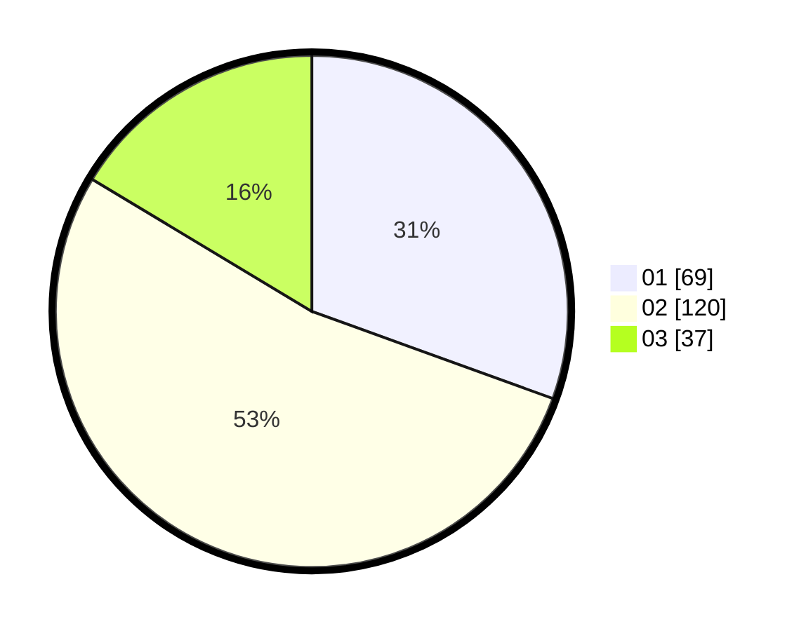

# Hasil

Hasil perolehan suara paslon dapat dilihat pada file paslon-01.txt, paslon-02.txt, dan paslon-03.txt.

Jika tidak ada, artinya data tersebut belum ada pada SIREKAP.

## Perolehan Suara

 * Paslon 01: **69**.
 * Paslon 02: **120**.
 * Paslon 03: **37**.

## Foto C Plano

https://sirekap-obj-formc.kpu.go.id/3911/pemilu/ppwp/31/73/01/10/03/3173011003045-20240216-004859--7eb09fa8-0dc2-4963-b06e-570c78906071.jpg

https://sirekap-obj-formc.kpu.go.id/3911/pemilu/ppwp/31/73/01/10/03/3173011003045-20240216-004902--c6cf05c5-585c-4f56-a049-f8d2d4f36348.jpg

https://sirekap-obj-formc.kpu.go.id/3911/pemilu/ppwp/31/73/01/10/03/3173011003045-20240216-004901--471803f2-1c5d-4167-8e1e-5873cb2c1641.jpg

## DATA PEMILIH TETAP

Jumlah pemilih dalam DPT: **287**.
 * L: **152**.
 * P: **135**.

## DATA PENGGUNA HAK PILIH

Jumlah pengguna hak pilih dalam DPT: **228**.
 * L: **120**.
 * P: **108**.

Jumlah pengguna hak pilih dalam DPTb: **0**.
 * L: **0**.
 * P: **0**.

Jumlah pengguna hak pilih dalam DPK: **0**.
 * L: **0**.
 * P: **0**.

Jumlah pengguna hak pilih: **228**.
 * L: **120**.
 * P: **108**.

## JUMLAH SUARA SAH DAN TIDAK SAH

JUMLAH SELURUH SUARA SAH: **226**.

JUMLAH SUARA TIDAK SAH: **2**.

JUMLAH SELURUH SUARA SAH DAN SUARA TIDAK SAH: **228**.
