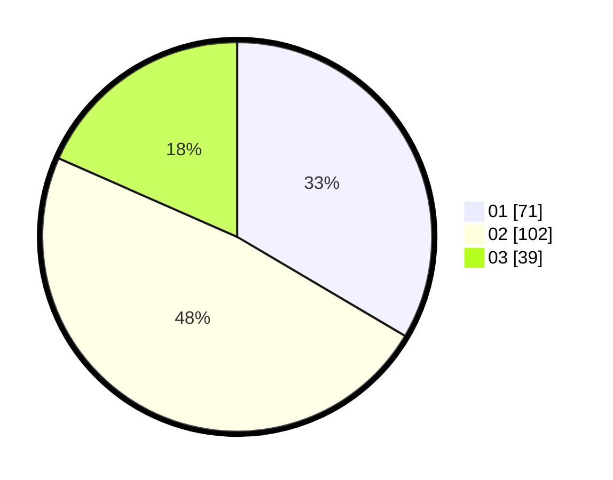

# Hasil

Hasil perolehan suara paslon dapat dilihat pada file paslon-01.txt, paslon-02.txt, dan paslon-03.txt.

Jika tidak ada, artinya data tersebut belum ada pada SIREKAP.

## Perolehan Suara

 * Paslon 01: **71**.
 * Paslon 02: **102**.
 * Paslon 03: **39**.

## Foto C Plano

https://sirekap-obj-formc.kpu.go.id/7269/pemilu/ppwp/31/73/01/10/03/3173011003046-20240215-222028--0ef97a8a-d345-4893-ac1b-0c0cb2237f9d.jpg

https://sirekap-obj-formc.kpu.go.id/7269/pemilu/ppwp/31/73/01/10/03/3173011003046-20240215-222030--58b720d7-f77c-4b36-8ec3-5b7b88f8acbc.jpg

https://sirekap-obj-formc.kpu.go.id/7269/pemilu/ppwp/31/73/01/10/03/3173011003046-20240215-222029--13e46aa5-05c3-484c-aae5-820f215f1cfe.jpg

## DATA PEMILIH TETAP

Jumlah pemilih dalam DPT: **293**.
 * L: **144**.
 * P: **149**.

## DATA PENGGUNA HAK PILIH

Jumlah pengguna hak pilih dalam DPT: **205**.
 * L: **95**.
 * P: **110**.

Jumlah pengguna hak pilih dalam DPTb: **6**.
 * L: **2**.
 * P: **4**.

Jumlah pengguna hak pilih dalam DPK: **4**.
 * L: **1**.
 * P: **3**.

Jumlah pengguna hak pilih: **215**.
 * L: **98**.
 * P: **117**.

## JUMLAH SUARA SAH DAN TIDAK SAH

JUMLAH SELURUH SUARA SAH: **212**.

JUMLAH SUARA TIDAK SAH: **3**.

JUMLAH SELURUH SUARA SAH DAN SUARA TIDAK SAH: **215**.
