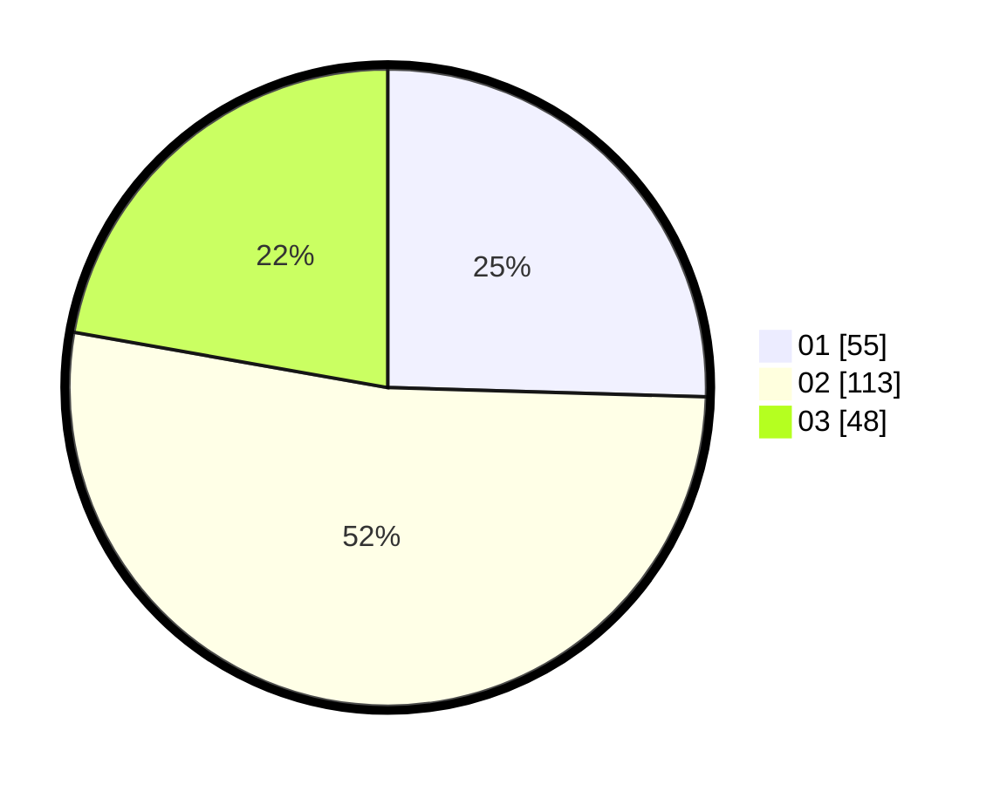

# Hasil

Hasil perolehan suara paslon dapat dilihat pada file paslon-01.txt, paslon-02.txt, dan paslon-03.txt.

Jika tidak ada, artinya data tersebut belum ada pada SIREKAP.

## Perolehan Suara

 * Paslon 01: **55**.
 * Paslon 02: **113**.
 * Paslon 03: **48**.

## Foto C Plano

https://sirekap-obj-formc.kpu.go.id/ecd0/pemilu/ppwp/31/73/01/10/03/3173011003051-20240216-142433--dd2c979e-41a0-4231-9aa2-f2a23fac35bd.jpg

https://sirekap-obj-formc.kpu.go.id/ecd0/pemilu/ppwp/31/73/01/10/03/3173011003051-20240216-142434--4a10aef7-2146-4bfe-91f0-98062395c00c.jpg

https://sirekap-obj-formc.kpu.go.id/ecd0/pemilu/ppwp/31/73/01/10/03/3173011003051-20240216-142434--bd7e35be-f19f-48cc-8c84-ba72019ec98f.jpg

## DATA PEMILIH TETAP

Jumlah pemilih dalam DPT: **297**.
 * L: **152**.
 * P: **145**.

## DATA PENGGUNA HAK PILIH

Jumlah pengguna hak pilih dalam DPT: **202**.
 * L: **101**.
 * P: **101**.

Jumlah pengguna hak pilih dalam DPTb: **2**.
 * L: **2**.
 * P: **0**.

Jumlah pengguna hak pilih dalam DPK: **18**.
 * L: **7**.
 * P: **11**.

Jumlah pengguna hak pilih: **222**.
 * L: **110**.
 * P: **112**.

## JUMLAH SUARA SAH DAN TIDAK SAH

JUMLAH SELURUH SUARA SAH: **216**.

JUMLAH SUARA TIDAK SAH: **6**.

JUMLAH SELURUH SUARA SAH DAN SUARA TIDAK SAH: **222**.
