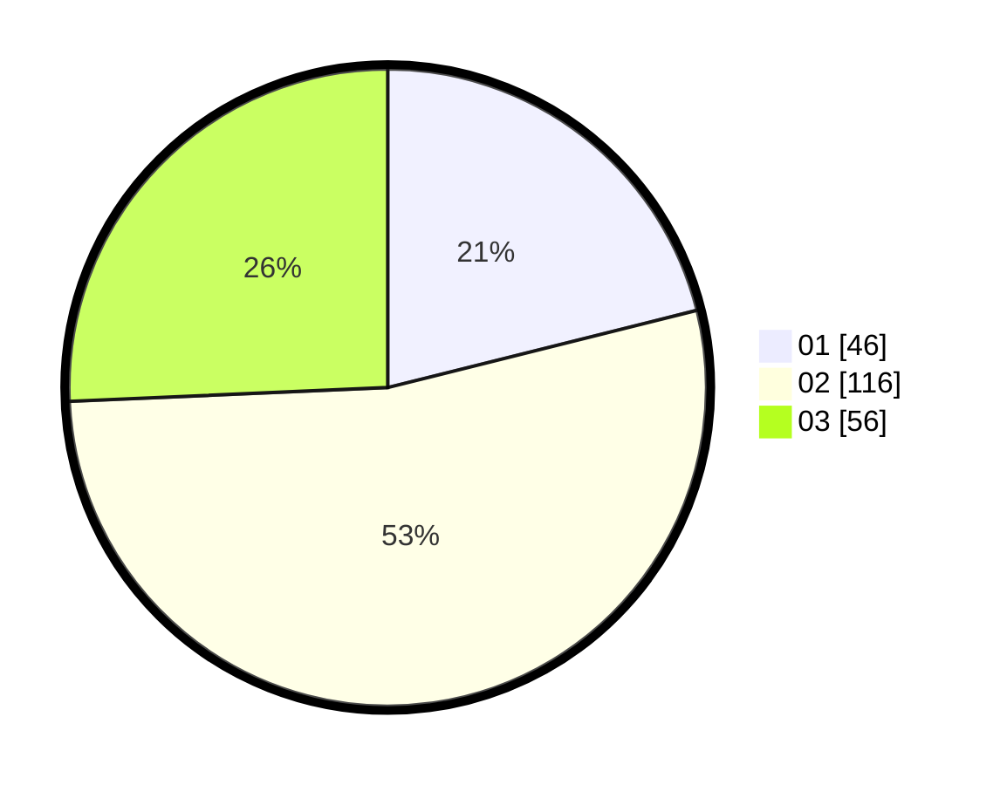

# Hasil

Hasil perolehan suara paslon dapat dilihat pada file paslon-01.txt, paslon-02.txt, dan paslon-03.txt.

Jika tidak ada, artinya data tersebut belum ada pada SIREKAP.

## Perolehan Suara

 * Paslon 01: **46**.
 * Paslon 02: **116**.
 * Paslon 03: **56**.

## Foto C Plano

https://sirekap-obj-formc.kpu.go.id/797d/pemilu/ppwp/31/73/01/10/03/3173011003058-20240216-144322--a9eebfcd-19fe-44e1-b4c5-3a366a25db97.jpg

https://sirekap-obj-formc.kpu.go.id/797d/pemilu/ppwp/31/73/01/10/03/3173011003058-20240216-144323--1ad10c69-a040-456c-99fc-13a7d3f6942c.jpg

https://sirekap-obj-formc.kpu.go.id/797d/pemilu/ppwp/31/73/01/10/03/3173011003058-20240216-144322--1e7e72dd-0d69-4fdb-bac9-c7ceb4ebc11a.jpg

## DATA PEMILIH TETAP

Jumlah pemilih dalam DPT: **282**.
 * L: **150**.
 * P: **132**.

## DATA PENGGUNA HAK PILIH

Jumlah pengguna hak pilih dalam DPT: **219**.
 * L: **115**.
 * P: **104**.

Jumlah pengguna hak pilih dalam DPTb: **0**.
 * L: **0**.
 * P: **0**.

Jumlah pengguna hak pilih dalam DPK: **0**.
 * L: **0**.
 * P: **0**.

Jumlah pengguna hak pilih: **219**.
 * L: **115**.
 * P: **104**.

## JUMLAH SUARA SAH DAN TIDAK SAH

JUMLAH SELURUH SUARA SAH: **218**.

JUMLAH SUARA TIDAK SAH: **1**.

JUMLAH SELURUH SUARA SAH DAN SUARA TIDAK SAH: **219**.
