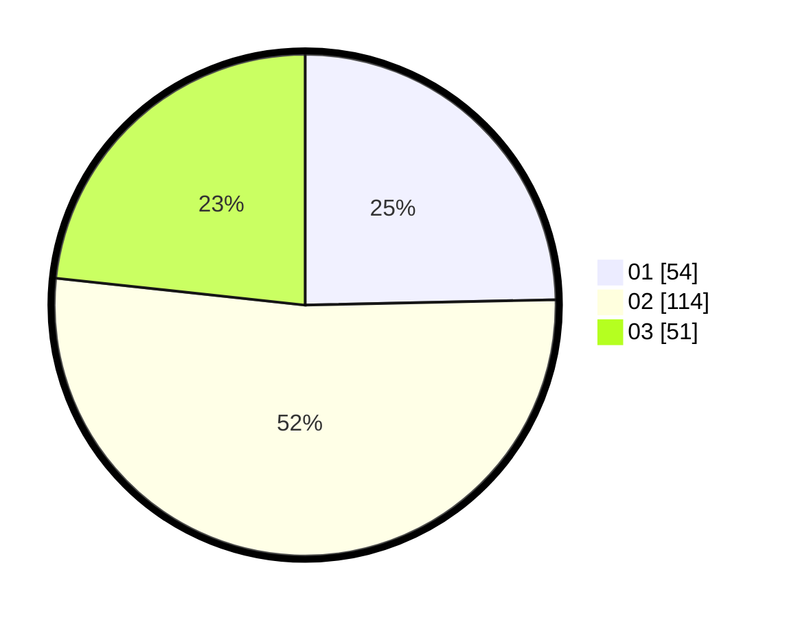

# Hasil

Hasil perolehan suara paslon dapat dilihat pada file paslon-01.txt, paslon-02.txt, dan paslon-03.txt.

Jika tidak ada, artinya data tersebut belum ada pada SIREKAP.

## Perolehan Suara

 * Paslon 01: **54**.
 * Paslon 02: **114**.
 * Paslon 03: **51**.

## Foto C Plano

https://sirekap-obj-formc.kpu.go.id/e0eb/pemilu/ppwp/31/73/01/10/03/3173011003060-20240215-003547--3485cd6c-13ee-4108-a4eb-1ece17418121.jpg

https://sirekap-obj-formc.kpu.go.id/e0eb/pemilu/ppwp/31/73/01/10/03/3173011003060-20240215-003144--1038a62e-fa0f-43e0-a4d5-32819786f9c7.jpg

https://sirekap-obj-formc.kpu.go.id/e0eb/pemilu/ppwp/31/73/01/10/03/3173011003060-20240215-003238--3af540dd-775f-41c8-9ce9-fb885d91c45a.jpg
