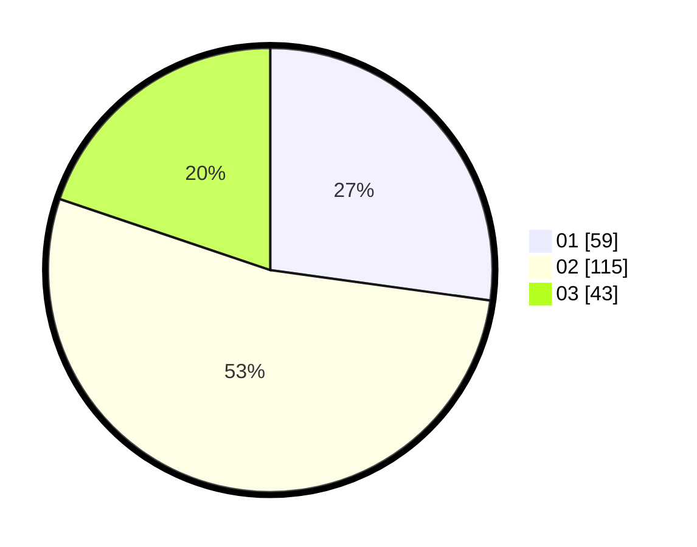

# Hasil

Hasil perolehan suara paslon dapat dilihat pada file paslon-01.txt, paslon-02.txt, dan paslon-03.txt.

Jika tidak ada, artinya data tersebut belum ada pada SIREKAP.

## Perolehan Suara

 * Paslon 01: **59**.
 * Paslon 02: **115**.
 * Paslon 03: **43**.

## Foto C Plano

https://sirekap-obj-formc.kpu.go.id/647d/pemilu/ppwp/31/73/01/10/03/3173011003062-20240216-121134--944f88d3-1738-458b-8af6-2b5f810b9183.jpg

https://sirekap-obj-formc.kpu.go.id/647d/pemilu/ppwp/31/73/01/10/03/3173011003062-20240216-121137--e95f77d0-ee9e-4940-b81a-c43c4939bd2d.jpg

https://sirekap-obj-formc.kpu.go.id/647d/pemilu/ppwp/31/73/01/10/03/3173011003062-20240216-121135--5b88f352-d765-4403-9a0e-f4b4e5602a35.jpg

## DATA PEMILIH TETAP

Jumlah pemilih dalam DPT: **271**.
 * L: **127**.
 * P: **144**.

## DATA PENGGUNA HAK PILIH

Jumlah pengguna hak pilih dalam DPT: **207**.
 * L: **92**.
 * P: **115**.

Jumlah pengguna hak pilih dalam DPTb: **12**.
 * L: **5**.
 * P: **7**.

Jumlah pengguna hak pilih dalam DPK: **0**.
 * L: **0**.
 * P: **0**.

Jumlah pengguna hak pilih: **219**.
 * L: **97**.
 * P: **122**.

## JUMLAH SUARA SAH DAN TIDAK SAH

JUMLAH SELURUH SUARA SAH: **217**.

JUMLAH SUARA TIDAK SAH: **2**.

JUMLAH SELURUH SUARA SAH DAN SUARA TIDAK SAH: **219**.
