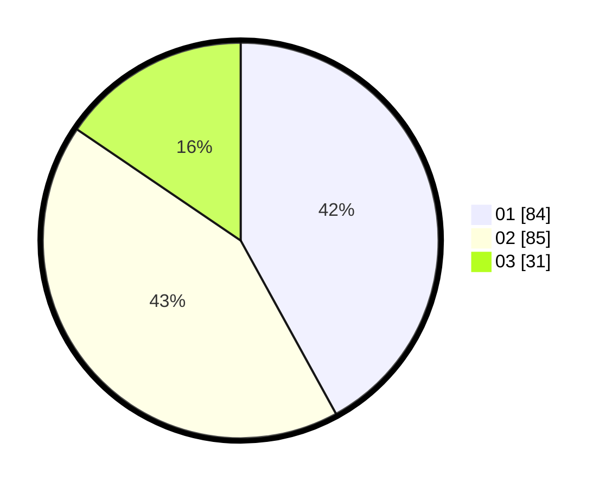

# Hasil

Hasil perolehan suara paslon dapat dilihat pada file paslon-01.txt, paslon-02.txt, dan paslon-03.txt.

Jika tidak ada, artinya data tersebut belum ada pada SIREKAP.

## Perolehan Suara

 * Paslon 01: **84**.
 * Paslon 02: **85**.
 * Paslon 03: **31**.

## Foto C Plano

https://sirekap-obj-formc.kpu.go.id/07c2/pemilu/ppwp/31/73/01/10/03/3173011003066-20240216-082630--0b983d85-9825-4704-9341-123d1abde4b2.jpg

https://sirekap-obj-formc.kpu.go.id/07c2/pemilu/ppwp/31/73/01/10/03/3173011003066-20240216-082632--8acde3d2-da5a-403f-ae9c-5ace54a75f18.jpg

https://sirekap-obj-formc.kpu.go.id/07c2/pemilu/ppwp/31/73/01/10/03/3173011003066-20240216-082631--4a551ab5-6083-45a2-90f4-84c25e18f7a9.jpg

## DATA PEMILIH TETAP

Jumlah pemilih dalam DPT: **270**.
 * L: **134**.
 * P: **136**.

## DATA PENGGUNA HAK PILIH

Jumlah pengguna hak pilih dalam DPT: **199**.
 * L: **97**.
 * P: **102**.

Jumlah pengguna hak pilih dalam DPTb: **1**.
 * L: **1**.
 * P: **0**.

Jumlah pengguna hak pilih dalam DPK: **2**.
 * L: **1**.
 * P: **1**.

Jumlah pengguna hak pilih: **202**.
 * L: **99**.
 * P: **103**.

## JUMLAH SUARA SAH DAN TIDAK SAH

JUMLAH SELURUH SUARA SAH: **200**.

JUMLAH SUARA TIDAK SAH: **2**.

JUMLAH SELURUH SUARA SAH DAN SUARA TIDAK SAH: **202**.
