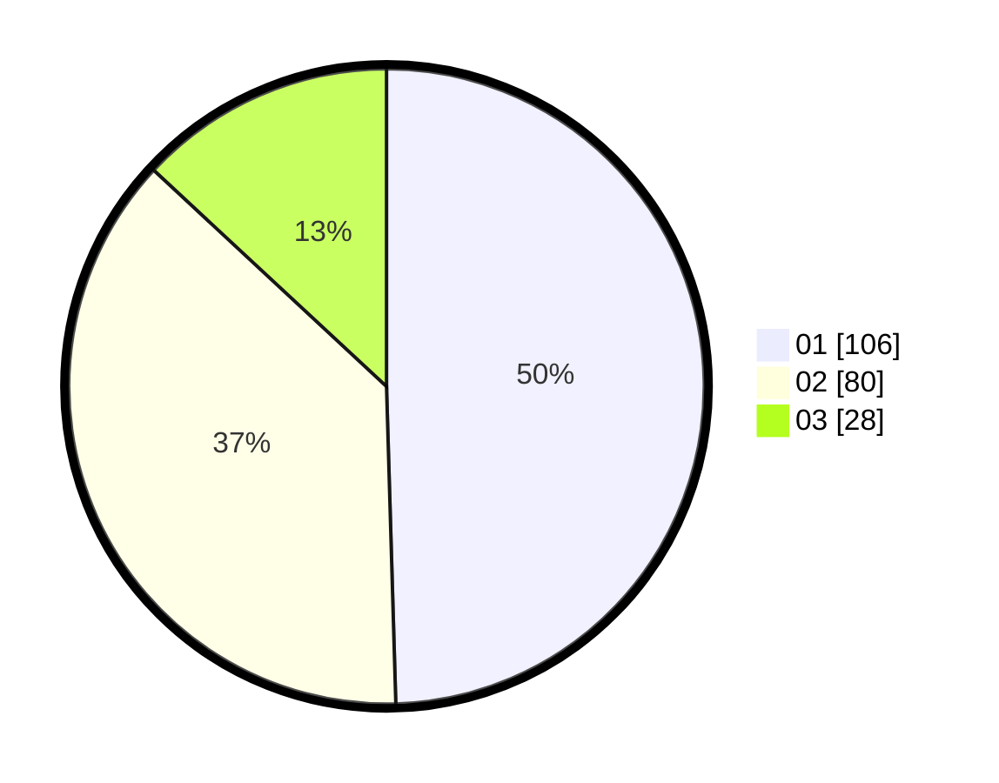

# Hasil

Hasil perolehan suara paslon dapat dilihat pada file paslon-01.txt, paslon-02.txt, dan paslon-03.txt.

Jika tidak ada, artinya data tersebut belum ada pada SIREKAP.

## Perolehan Suara

 * Paslon 01: **106**.
 * Paslon 02: **80**.
 * Paslon 03: **28**.

## Foto C Plano

https://sirekap-obj-formc.kpu.go.id/2227/pemilu/ppwp/31/73/01/10/03/3173011003067-20240216-141053--19c564f6-7186-4ed0-8645-266b3f253afc.jpg

https://sirekap-obj-formc.kpu.go.id/2227/pemilu/ppwp/31/73/01/10/03/3173011003067-20240216-141054--e38ac62c-5e7c-465c-88d5-de69c47efe1f.jpg

https://sirekap-obj-formc.kpu.go.id/2227/pemilu/ppwp/31/73/01/10/03/3173011003067-20240216-141053--d3674b72-5cd5-4cce-9b16-fcbd9980890e.jpg

## DATA PEMILIH TETAP

Jumlah pemilih dalam DPT: **267**.
 * L: **121**.
 * P: **146**.

## DATA PENGGUNA HAK PILIH

Jumlah pengguna hak pilih dalam DPT: **205**.
 * L: **88**.
 * P: **117**.

Jumlah pengguna hak pilih dalam DPTb: **5**.
 * L: **1**.
 * P: **4**.

Jumlah pengguna hak pilih dalam DPK: **4**.
 * L: **2**.
 * P: **2**.

Jumlah pengguna hak pilih: **214**.
 * L: **91**.
 * P: **123**.

## JUMLAH SUARA SAH DAN TIDAK SAH

JUMLAH SELURUH SUARA SAH: **214**.

JUMLAH SUARA TIDAK SAH: **0**.

JUMLAH SELURUH SUARA SAH DAN SUARA TIDAK SAH: **214**.
