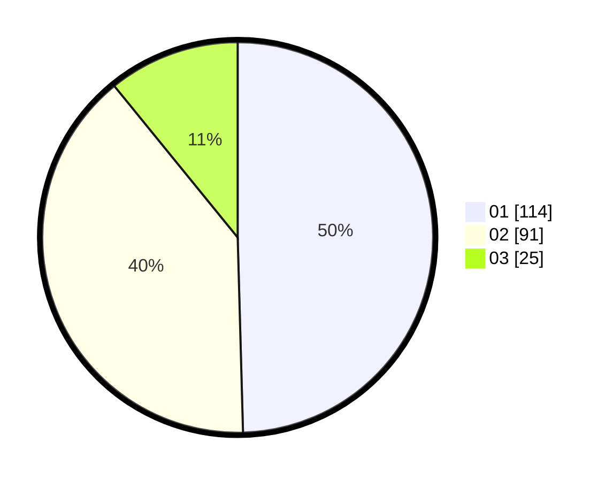

# Hasil

Hasil perolehan suara paslon dapat dilihat pada file paslon-01.txt, paslon-02.txt, dan paslon-03.txt.

Jika tidak ada, artinya data tersebut belum ada pada SIREKAP.

## Perolehan Suara

 * Paslon 01: **114**.
 * Paslon 02: **91**.
 * Paslon 03: **25**.

## Foto C Plano

https://sirekap-obj-formc.kpu.go.id/c225/pemilu/ppwp/31/73/01/10/03/3173011003069-20240217-203719--d1f13822-16c9-4351-a0e0-72fcd26d45db.jpg

https://sirekap-obj-formc.kpu.go.id/c225/pemilu/ppwp/31/73/01/10/03/3173011003069-20240217-203721--4d22f9f1-52b7-44e8-981e-95ff1eb01d43.jpg

https://sirekap-obj-formc.kpu.go.id/c225/pemilu/ppwp/31/73/01/10/03/3173011003069-20240217-203720--0f8fa98a-49df-4cb3-8305-ce038b468037.jpg

## DATA PEMILIH TETAP

Jumlah pemilih dalam DPT: **273**.
 * L: **130**.
 * P: **143**.

## DATA PENGGUNA HAK PILIH

Jumlah pengguna hak pilih dalam DPT: **224**.
 * L: **103**.
 * P: **121**.

Jumlah pengguna hak pilih dalam DPTb: **1**.
 * L: **0**.
 * P: **1**.

Jumlah pengguna hak pilih dalam DPK: **6**.
 * L: **2**.
 * P: **4**.

Jumlah pengguna hak pilih: **231**.
 * L: **105**.
 * P: **126**.

## JUMLAH SUARA SAH DAN TIDAK SAH

JUMLAH SELURUH SUARA SAH: **230**.

JUMLAH SUARA TIDAK SAH: **1**.

JUMLAH SELURUH SUARA SAH DAN SUARA TIDAK SAH: **231**.
