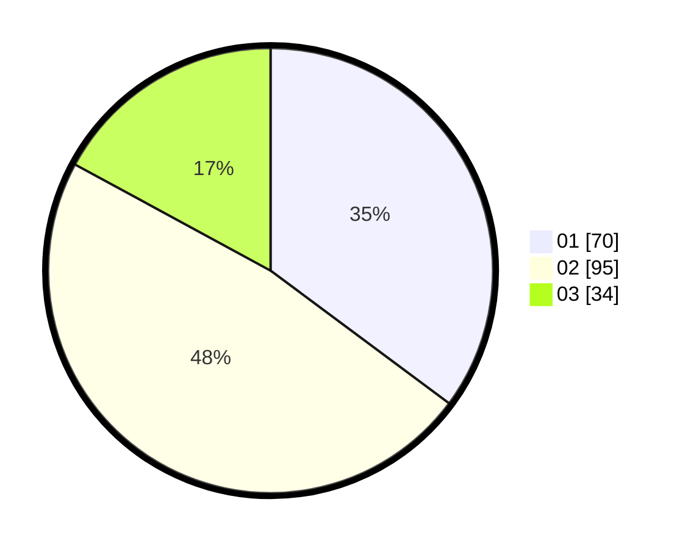

# Hasil

Hasil perolehan suara paslon dapat dilihat pada file paslon-01.txt, paslon-02.txt, dan paslon-03.txt.

Jika tidak ada, artinya data tersebut belum ada pada SIREKAP.

## Perolehan Suara

 * Paslon 01: **70**.
 * Paslon 02: **95**.
 * Paslon 03: **34**.

## Foto C Plano

https://sirekap-obj-formc.kpu.go.id/49c3/pemilu/ppwp/31/73/01/10/03/3173011003075-20240216-150059--075f54c9-f11b-4415-8add-e74e0d663a9f.jpg

https://sirekap-obj-formc.kpu.go.id/49c3/pemilu/ppwp/31/73/01/10/03/3173011003075-20240216-150101--73c24449-859a-4876-bbda-265bf512d78e.jpg

https://sirekap-obj-formc.kpu.go.id/49c3/pemilu/ppwp/31/73/01/10/03/3173011003075-20240216-150100--2040973f-7e41-4d91-84e8-8c228415be7b.jpg

## DATA PEMILIH TETAP

Jumlah pemilih dalam DPT: **254**.
 * L: **126**.
 * P: **128**.

## DATA PENGGUNA HAK PILIH

Jumlah pengguna hak pilih dalam DPT: **204**.
 * L: **98**.
 * P: **106**.

Jumlah pengguna hak pilih dalam DPTb: **0**.
 * L: **0**.
 * P: **0**.

Jumlah pengguna hak pilih dalam DPK: **0**.
 * L: **0**.
 * P: **0**.

Jumlah pengguna hak pilih: **204**.
 * L: **98**.
 * P: **106**.

## JUMLAH SUARA SAH DAN TIDAK SAH

JUMLAH SELURUH SUARA SAH: **199**.

JUMLAH SUARA TIDAK SAH: **5**.

JUMLAH SELURUH SUARA SAH DAN SUARA TIDAK SAH: **204**.
