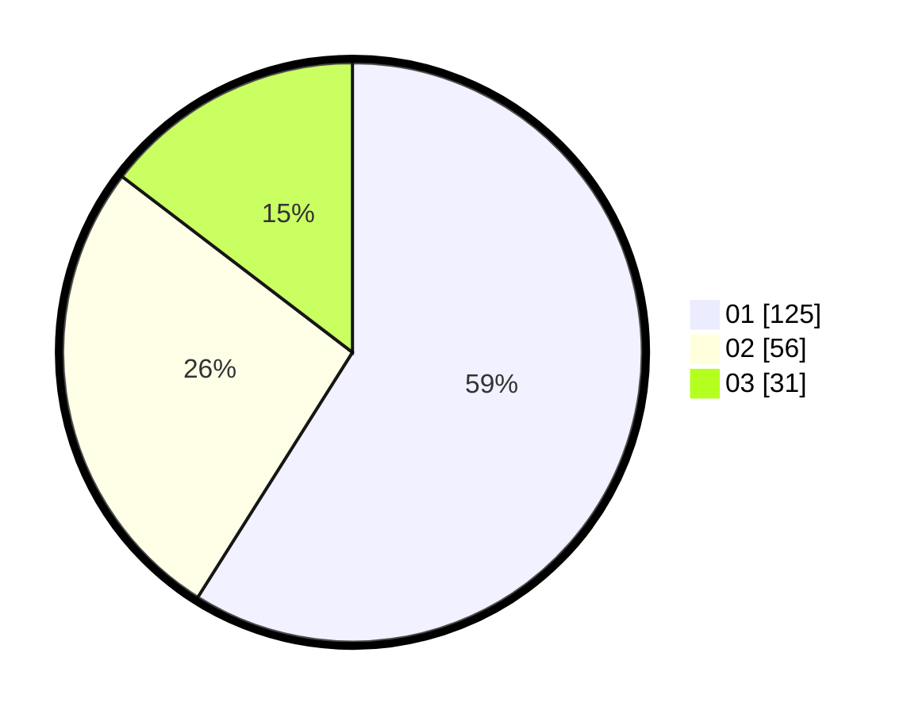

# Hasil

Hasil perolehan suara paslon dapat dilihat pada file paslon-01.txt, paslon-02.txt, dan paslon-03.txt.

Jika tidak ada, artinya data tersebut belum ada pada SIREKAP.

## Perolehan Suara

 * Paslon 01: **125**.
 * Paslon 02: **56**.
 * Paslon 03: **31**.

## Foto C Plano

https://sirekap-obj-formc.kpu.go.id/5362/pemilu/ppwp/31/73/01/10/03/3173011003076-20240217-174753--e8ba2519-49b5-4295-bc4d-4cab5ee81f95.jpg

https://sirekap-obj-formc.kpu.go.id/5362/pemilu/ppwp/31/73/01/10/03/3173011003076-20240217-174849--e4d2d4e6-e8df-4688-b529-e65393eaba0e.jpg

https://sirekap-obj-formc.kpu.go.id/5362/pemilu/ppwp/31/73/01/10/03/3173011003076-20240217-174954--4c8b0d91-60dd-4fea-ba41-7b4359c8bc8f.jpg

## DATA PEMILIH TETAP

Jumlah pemilih dalam DPT: **272**.
 * L: **138**.
 * P: **134**.

## DATA PENGGUNA HAK PILIH

Jumlah pengguna hak pilih dalam DPT: **214**.
 * L: **112**.
 * P: **102**.

Jumlah pengguna hak pilih dalam DPTb: **2**.
 * L: **1**.
 * P: **1**.

Jumlah pengguna hak pilih dalam DPK: **0**.
 * L: **0**.
 * P: **0**.

Jumlah pengguna hak pilih: **216**.
 * L: **113**.
 * P: **103**.

## JUMLAH SUARA SAH DAN TIDAK SAH

JUMLAH SELURUH SUARA SAH: **212**.

JUMLAH SUARA TIDAK SAH: **4**.

JUMLAH SELURUH SUARA SAH DAN SUARA TIDAK SAH: **216**.
