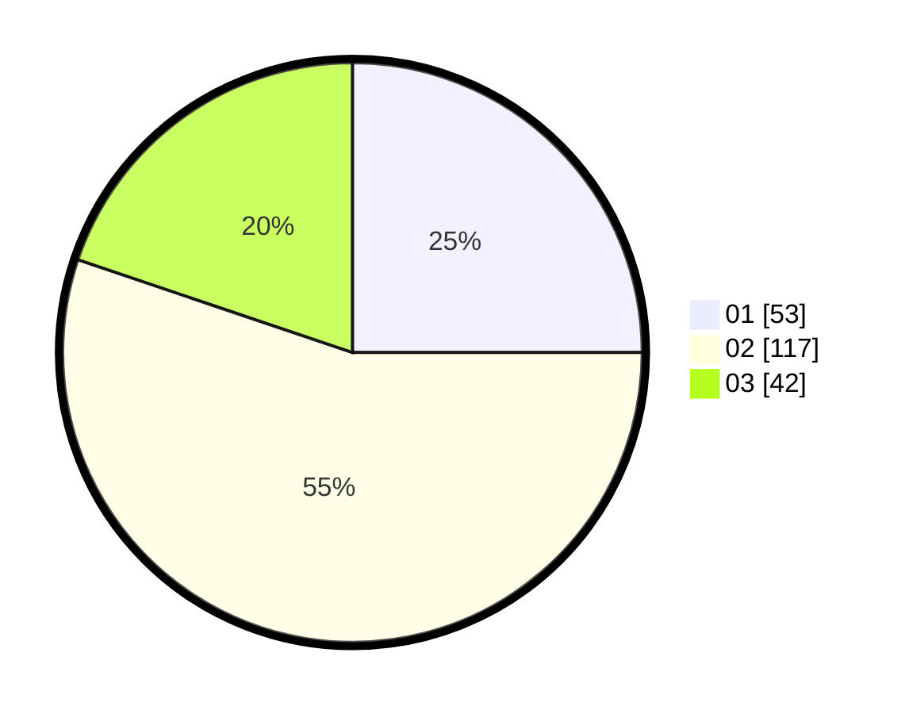

# Hasil

Hasil perolehan suara paslon dapat dilihat pada file paslon-01.txt, paslon-02.txt, dan paslon-03.txt.

Jika tidak ada, artinya data tersebut belum ada pada SIREKAP.

## Perolehan Suara

 * Paslon 01: **53**.
 * Paslon 02: **117**.
 * Paslon 03: **42**.

## Foto C Plano

https://sirekap-obj-formc.kpu.go.id/2554/pemilu/ppwp/31/73/01/10/03/3173011003077-20240216-045507--112ab1d0-5731-4dea-9213-bfc1bcf2a3af.jpg

https://sirekap-obj-formc.kpu.go.id/2554/pemilu/ppwp/31/73/01/10/03/3173011003077-20240216-045508--1e62c758-a463-49f9-aeff-3b51c8724fff.jpg

https://sirekap-obj-formc.kpu.go.id/2554/pemilu/ppwp/31/73/01/10/03/3173011003077-20240216-045508--22fd2fd3-647a-4859-a059-91a7470980ef.jpg

## DATA PEMILIH TETAP

Jumlah pemilih dalam DPT: **272**.
 * L: **145**.
 * P: **127**.

## DATA PENGGUNA HAK PILIH

Jumlah pengguna hak pilih dalam DPT: **208**.
 * L: **105**.
 * P: **103**.

Jumlah pengguna hak pilih dalam DPTb: **2**.
 * L: **1**.
 * P: **1**.

Jumlah pengguna hak pilih dalam DPK: **3**.
 * L: **1**.
 * P: **2**.

Jumlah pengguna hak pilih: **213**.
 * L: **107**.
 * P: **106**.

## JUMLAH SUARA SAH DAN TIDAK SAH

JUMLAH SELURUH SUARA SAH: **212**.

JUMLAH SUARA TIDAK SAH: **1**.

JUMLAH SELURUH SUARA SAH DAN SUARA TIDAK SAH: **213**.
