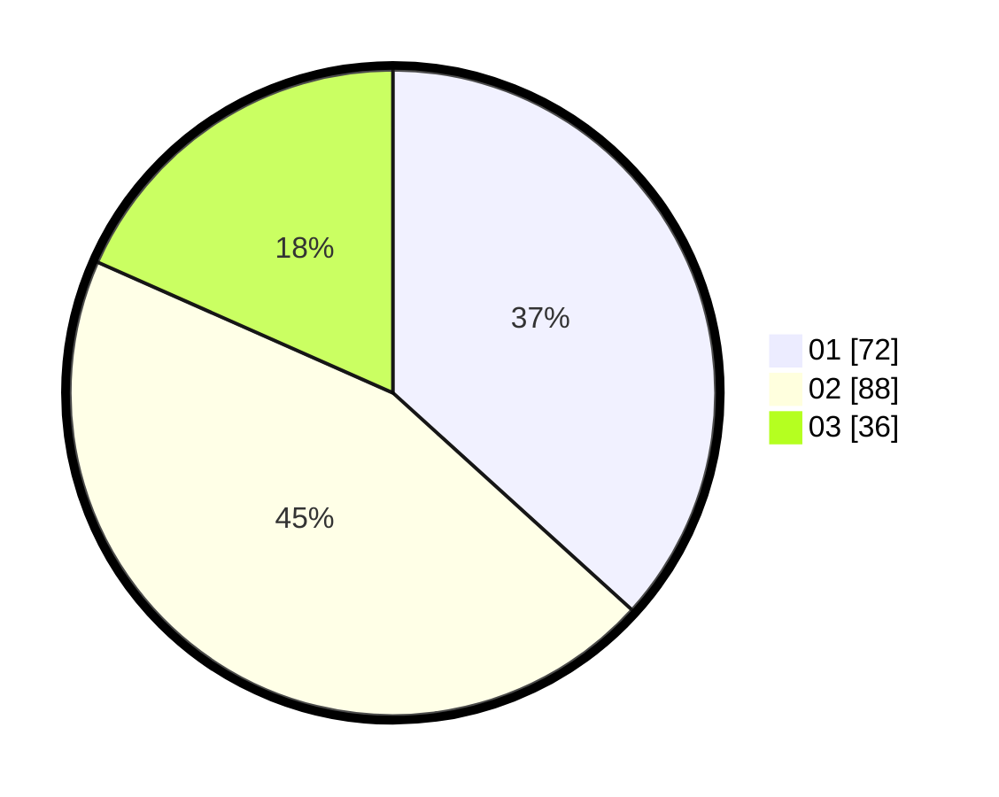

# Hasil

Hasil perolehan suara paslon dapat dilihat pada file paslon-01.txt, paslon-02.txt, dan paslon-03.txt.

Jika tidak ada, artinya data tersebut belum ada pada SIREKAP.

## Perolehan Suara

 * Paslon 01: **72**.
 * Paslon 02: **88**.
 * Paslon 03: **36**.

## Foto C Plano

https://sirekap-obj-formc.kpu.go.id/c21b/pemilu/ppwp/31/73/01/10/03/3173011003083-20240215-235811--5b338356-a454-414d-8e37-4eb2955b26b5.jpg

https://sirekap-obj-formc.kpu.go.id/c21b/pemilu/ppwp/31/73/01/10/03/3173011003083-20240215-235813--d6499602-ae28-4b67-8014-65e33d29cb3f.jpg

https://sirekap-obj-formc.kpu.go.id/c21b/pemilu/ppwp/31/73/01/10/03/3173011003083-20240215-235812--a95ca4dc-548b-4774-a280-89be78bdef7a.jpg

## DATA PEMILIH TETAP

Jumlah pemilih dalam DPT: **268**.
 * L: **120**.
 * P: **148**.

## DATA PENGGUNA HAK PILIH

Jumlah pengguna hak pilih dalam DPT: **196**.
 * L: **83**.
 * P: **113**.

Jumlah pengguna hak pilih dalam DPTb: **0**.
 * L: **0**.
 * P: **0**.

Jumlah pengguna hak pilih dalam DPK: **4**.
 * L: **2**.
 * P: **2**.

Jumlah pengguna hak pilih: **200**.
 * L: **85**.
 * P: **115**.

## JUMLAH SUARA SAH DAN TIDAK SAH

JUMLAH SELURUH SUARA SAH: **196**.

JUMLAH SUARA TIDAK SAH: **4**.

JUMLAH SELURUH SUARA SAH DAN SUARA TIDAK SAH: **200**.
