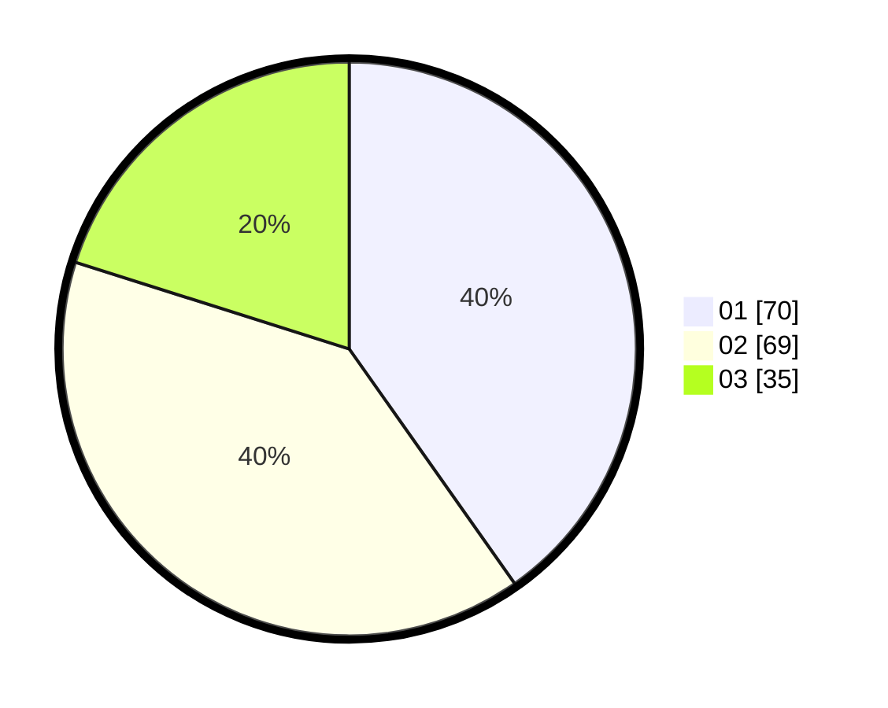

# Hasil

Hasil perolehan suara paslon dapat dilihat pada file paslon-01.txt, paslon-02.txt, dan paslon-03.txt.

Jika tidak ada, artinya data tersebut belum ada pada SIREKAP.

## Perolehan Suara

 * Paslon 01: **70**.
 * Paslon 02: **69**.
 * Paslon 03: **35**.

## Foto C Plano

https://sirekap-obj-formc.kpu.go.id/d0f1/pemilu/ppwp/31/73/01/10/03/3173011003089-20240215-204707--c3a65489-6b96-4199-840d-0af2652801c6.jpg

https://sirekap-obj-formc.kpu.go.id/d0f1/pemilu/ppwp/31/73/01/10/03/3173011003089-20240215-204709--7e954506-198c-47d5-9d09-1b5330e0bc40.jpg

https://sirekap-obj-formc.kpu.go.id/d0f1/pemilu/ppwp/31/73/01/10/03/3173011003089-20240215-204708--99d12eda-31ad-4804-8d2b-b1c3a0d8d017.jpg

## DATA PEMILIH TETAP

Jumlah pemilih dalam DPT: **265**.
 * L: **131**.
 * P: **134**.

## DATA PENGGUNA HAK PILIH

Jumlah pengguna hak pilih dalam DPT: **179**.
 * L: **84**.
 * P: **95**.

Jumlah pengguna hak pilih dalam DPTb: **0**.
 * L: **0**.
 * P: **0**.

Jumlah pengguna hak pilih dalam DPK: **1**.
 * L: **0**.
 * P: **1**.

Jumlah pengguna hak pilih: **180**.
 * L: **84**.
 * P: **96**.

## JUMLAH SUARA SAH DAN TIDAK SAH

JUMLAH SELURUH SUARA SAH: **174**.

JUMLAH SUARA TIDAK SAH: **6**.

JUMLAH SELURUH SUARA SAH DAN SUARA TIDAK SAH: **180**.
