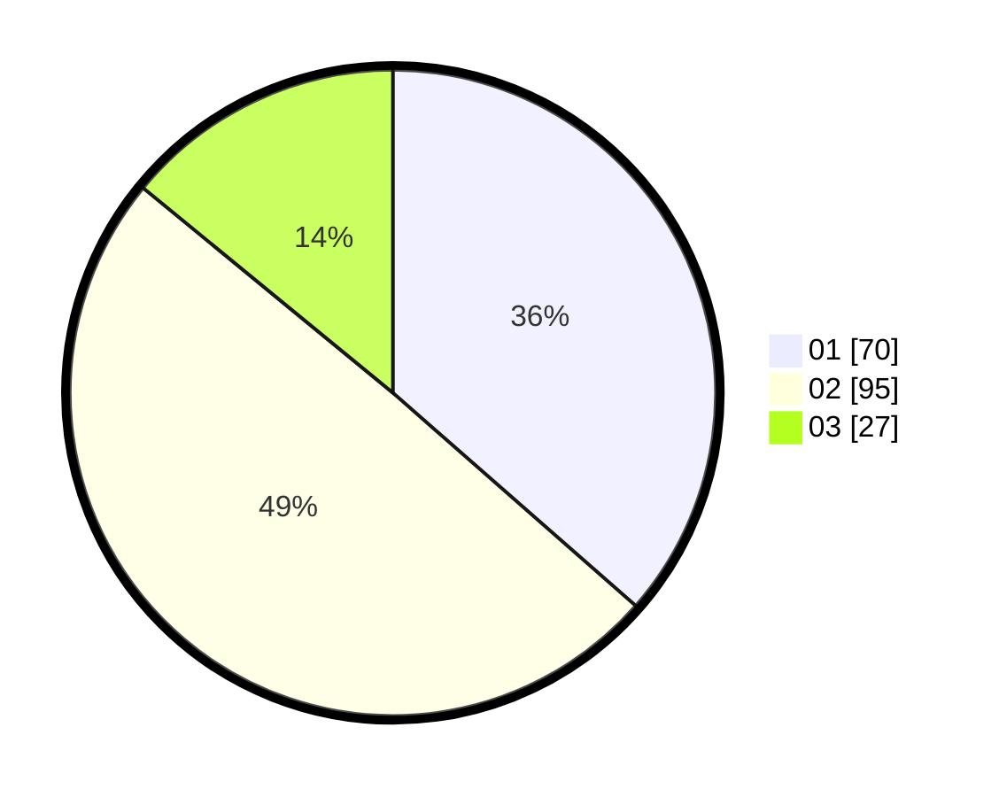

# Hasil

Hasil perolehan suara paslon dapat dilihat pada file paslon-01.txt, paslon-02.txt, dan paslon-03.txt.

Jika tidak ada, artinya data tersebut belum ada pada SIREKAP.

## Perolehan Suara

 * Paslon 01: **70**.
 * Paslon 02: **95**.
 * Paslon 03: **27**.

## Foto C Plano

https://sirekap-obj-formc.kpu.go.id/eb94/pemilu/ppwp/31/73/01/10/03/3173011003102-20240214-225736--2c9b02e1-2e34-4ca4-a199-9e5364bbc482.jpg

https://sirekap-obj-formc.kpu.go.id/eb94/pemilu/ppwp/31/73/01/10/03/3173011003102-20240214-234702--d92cc945-6679-4f7b-9e79-40ca51241d4a.jpg

https://sirekap-obj-formc.kpu.go.id/eb94/pemilu/ppwp/31/73/01/10/03/3173011003102-20240214-234618--b39812f6-39b0-4cf1-a2a4-fd08d126d4d4.jpg

## DATA PEMILIH TETAP

Jumlah pemilih dalam DPT: **267**.
 * L: **193**.
 * P: **134**.

## DATA PENGGUNA HAK PILIH

Jumlah pengguna hak pilih dalam DPT: **199**.
 * L: **95**.
 * P: **104**.

Jumlah pengguna hak pilih dalam DPTb: **0**.
 * L: **0**.
 * P: **0**.

Jumlah pengguna hak pilih dalam DPK: **0**.
 * L: **0**.
 * P: **0**.

Jumlah pengguna hak pilih: **199**.
 * L: **95**.
 * P: **104**.

## JUMLAH SUARA SAH DAN TIDAK SAH

JUMLAH SELURUH SUARA SAH: **192**.

JUMLAH SUARA TIDAK SAH: **7**.

JUMLAH SELURUH SUARA SAH DAN SUARA TIDAK SAH: **199**.
