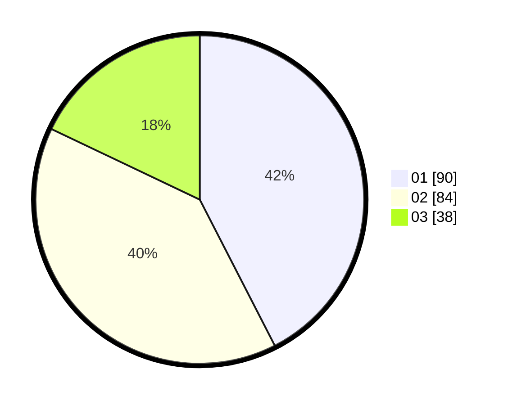

# Hasil

Hasil perolehan suara paslon dapat dilihat pada file paslon-01.txt, paslon-02.txt, dan paslon-03.txt.

Jika tidak ada, artinya data tersebut belum ada pada SIREKAP.

## Perolehan Suara

 * Paslon 01: **90**.
 * Paslon 02: **84**.
 * Paslon 03: **38**.

## Foto C Plano

https://sirekap-obj-formc.kpu.go.id/0e83/pemilu/ppwp/31/73/01/10/03/3173011003108-20240216-131633--d5dfaf6b-4acf-4705-9c46-4d36257d3a96.jpg

https://sirekap-obj-formc.kpu.go.id/0e83/pemilu/ppwp/31/73/01/10/03/3173011003108-20240216-131636--8e74bdaf-2ba9-4796-83b9-16e9240b0d68.jpg

https://sirekap-obj-formc.kpu.go.id/0e83/pemilu/ppwp/31/73/01/10/03/3173011003108-20240216-131635--6a678141-cdfb-4d3a-86fe-5f8f22bc4c47.jpg

## DATA PEMILIH TETAP

Jumlah pemilih dalam DPT: **212**.
 * L: **100**.
 * P: **112**.

## DATA PENGGUNA HAK PILIH

Jumlah pengguna hak pilih dalam DPT: **212**.
 * L: **100**.
 * P: **112**.

Jumlah pengguna hak pilih dalam DPTb: **0**.
 * L: **0**.
 * P: **0**.

Jumlah pengguna hak pilih dalam DPK: **0**.
 * L: **2**.
 * P: **0**.

Jumlah pengguna hak pilih: **214**.
 * L: **102**.
 * P: **112**.

## JUMLAH SUARA SAH DAN TIDAK SAH

JUMLAH SELURUH SUARA SAH: **212**.

JUMLAH SUARA TIDAK SAH: **2**.

JUMLAH SELURUH SUARA SAH DAN SUARA TIDAK SAH: **214**.
