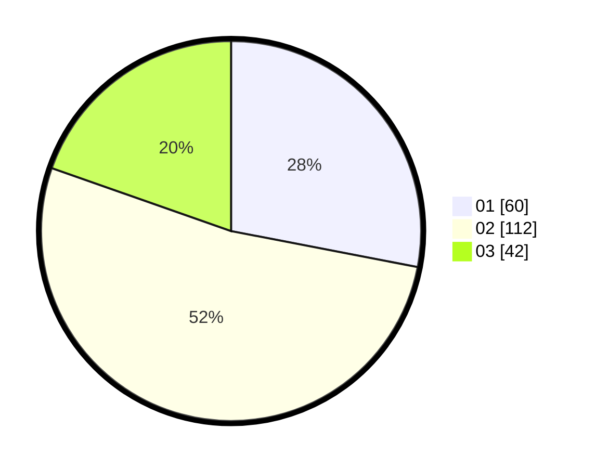

# Hasil

Hasil perolehan suara paslon dapat dilihat pada file paslon-01.txt, paslon-02.txt, dan paslon-03.txt.

Jika tidak ada, artinya data tersebut belum ada pada SIREKAP.

## Perolehan Suara

 * Paslon 01: **60**.
 * Paslon 02: **112**.
 * Paslon 03: **42**.

## Foto C Plano

https://sirekap-obj-formc.kpu.go.id/36d7/pemilu/ppwp/31/73/01/10/03/3173011003120-20240214-194708--3b08dc10-10b6-4a59-9400-364c9204618a.jpg

https://sirekap-obj-formc.kpu.go.id/36d7/pemilu/ppwp/31/73/01/10/03/3173011003120-20240214-194909--100a5692-82be-4895-879d-02b706b13512.jpg
