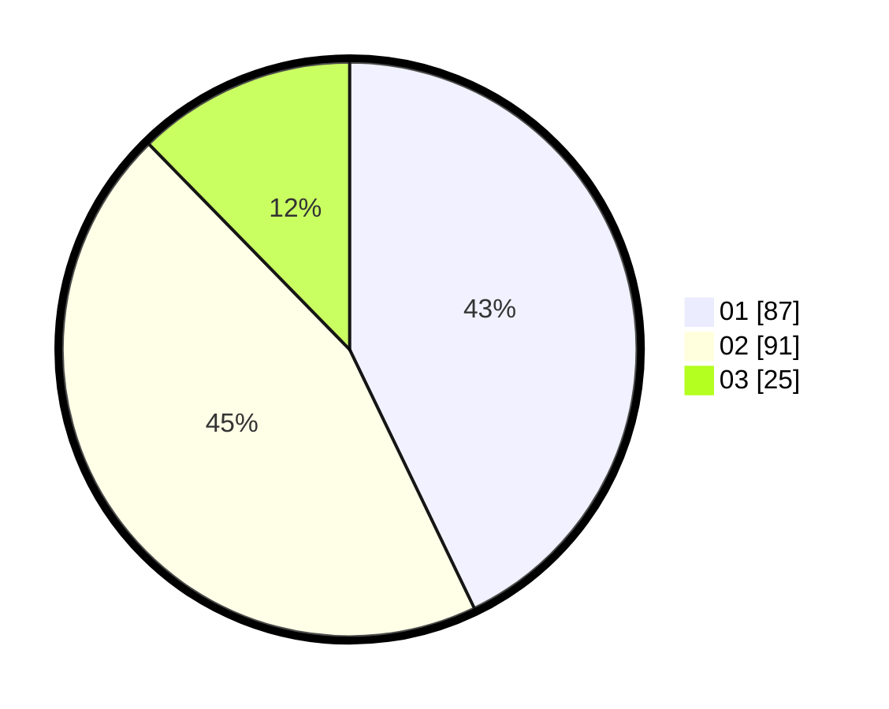

# Hasil

Hasil perolehan suara paslon dapat dilihat pada file paslon-01.txt, paslon-02.txt, dan paslon-03.txt.

Jika tidak ada, artinya data tersebut belum ada pada SIREKAP.

## Perolehan Suara

 * Paslon 01: **87**.
 * Paslon 02: **91**.
 * Paslon 03: **25**.

## Foto C Plano

https://sirekap-obj-formc.kpu.go.id/b041/pemilu/ppwp/31/73/01/10/03/3173011003123-20240214-211534--996baac6-2d67-4a41-beef-d7b63390b8c0.jpg

https://sirekap-obj-formc.kpu.go.id/b041/pemilu/ppwp/31/73/01/10/03/3173011003123-20240214-203514--3975eadd-79cb-4059-9881-1e84e25dedbb.jpg

https://sirekap-obj-formc.kpu.go.id/b041/pemilu/ppwp/31/73/01/10/03/3173011003123-20240214-203544--46ea26fc-fd53-4cf9-9948-63a29b37ead1.jpg

## DATA PEMILIH TETAP

Jumlah pemilih dalam DPT: **268**.
 * L: **131**.
 * P: **137**.

## DATA PENGGUNA HAK PILIH

Jumlah pengguna hak pilih dalam DPT: **201**.
 * L: **95**.
 * P: **106**.

Jumlah pengguna hak pilih dalam DPTb: **0**.
 * L: **0**.
 * P: **0**.

Jumlah pengguna hak pilih dalam DPK: **5**.
 * L: **3**.
 * P: **2**.

Jumlah pengguna hak pilih: **206**.
 * L: **98**.
 * P: **108**.

## JUMLAH SUARA SAH DAN TIDAK SAH

JUMLAH SELURUH SUARA SAH: **203**.

JUMLAH SUARA TIDAK SAH: **3**.

JUMLAH SELURUH SUARA SAH DAN SUARA TIDAK SAH: **206**.
