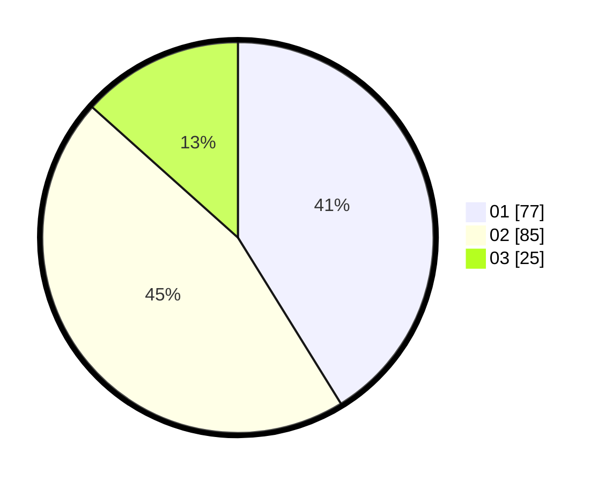

# Hasil

Hasil perolehan suara paslon dapat dilihat pada file paslon-01.txt, paslon-02.txt, dan paslon-03.txt.

Jika tidak ada, artinya data tersebut belum ada pada SIREKAP.

## Perolehan Suara

 * Paslon 01: **77**.
 * Paslon 02: **85**.
 * Paslon 03: **25**.

## Foto C Plano

https://sirekap-obj-formc.kpu.go.id/7317/pemilu/ppwp/31/73/01/10/03/3173011003128-20240216-004626--da2ffa15-cdf3-4778-8dcd-20e51cfd8fc1.jpg

https://sirekap-obj-formc.kpu.go.id/7317/pemilu/ppwp/31/73/01/10/03/3173011003128-20240216-004629--8ca15279-fd96-418e-8570-5a28e4c64d2f.jpg

https://sirekap-obj-formc.kpu.go.id/7317/pemilu/ppwp/31/73/01/10/03/3173011003128-20240216-004629--43eb3fc3-30db-4395-8cd0-f9fefd45f612.jpg

## DATA PEMILIH TETAP

Jumlah pemilih dalam DPT: **242**.
 * L: **120**.
 * P: **122**.

## DATA PENGGUNA HAK PILIH

Jumlah pengguna hak pilih dalam DPT: **187**.
 * L: **88**.
 * P: **99**.

Jumlah pengguna hak pilih dalam DPTb: **0**.
 * L: **0**.
 * P: **0**.

Jumlah pengguna hak pilih dalam DPK: **0**.
 * L: **0**.
 * P: **0**.

Jumlah pengguna hak pilih: **187**.
 * L: **88**.
 * P: **99**.

## JUMLAH SUARA SAH DAN TIDAK SAH

JUMLAH SELURUH SUARA SAH: **187**.

JUMLAH SUARA TIDAK SAH: **0**.

JUMLAH SELURUH SUARA SAH DAN SUARA TIDAK SAH: **187**.
